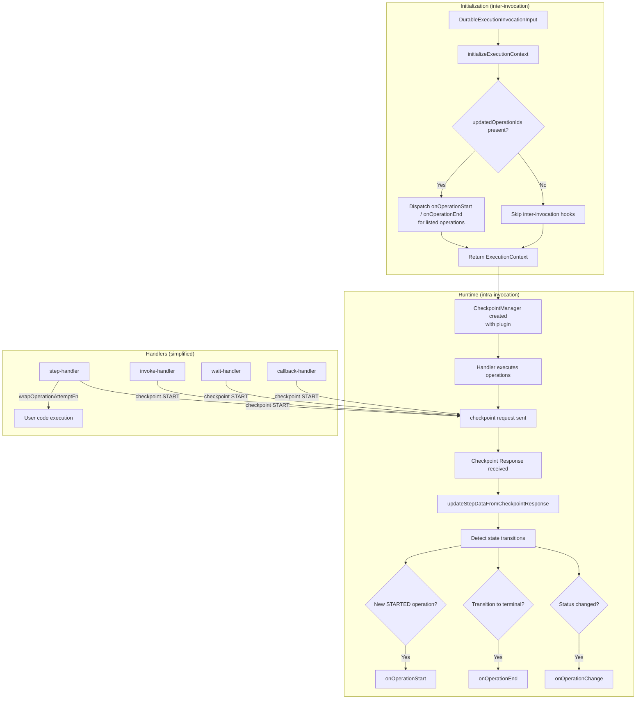
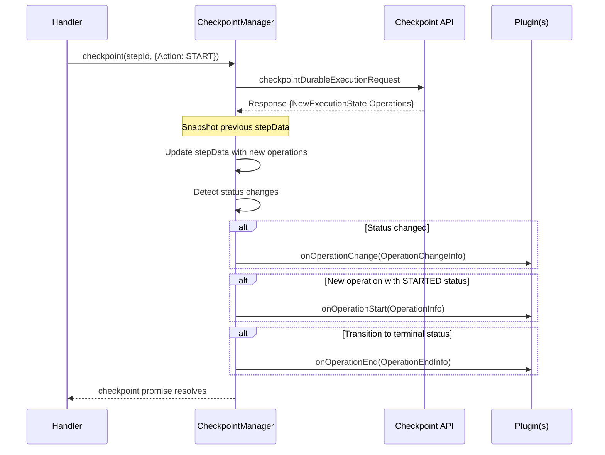
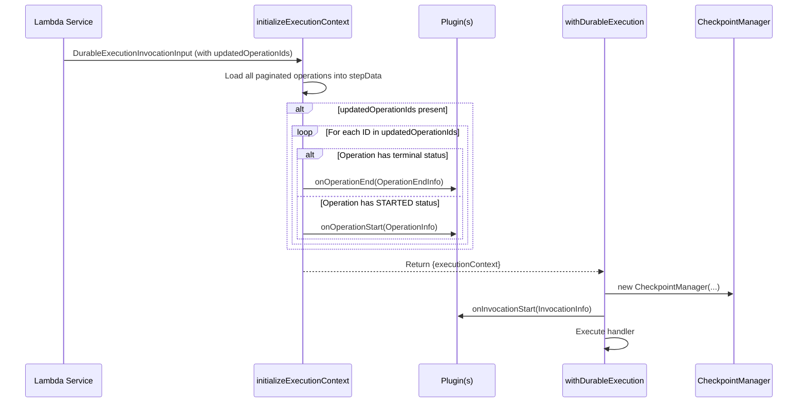

# Design Document: Checkpoint-Driven Plugin Hooks

## Overview

This feature adds operation-level plugin hook dispatch (`onOperationStart`, `onOperationEnd`) to the `CheckpointManager`, driven by checkpoint request/response data. Additionally, it handles operations that complete between Lambda invocations via a new `updatedOperationIds` field on `DurableExecutionInvocationInput`, adds `wrapOperationAttemptFn` to the step-handler, and removes the redundant `onOperationAttemptStart`/`onOperationAttemptEnd` hooks (along with `AttemptEndInfo` and `AttemptEndInfoOutcome` types).

**Current state (main branch, after PR #596):** The plugin is already wired at the invocation level — `onInvocationStart`, `onInvocationEnd`, `wrapInvocation`, and `onOperationChange` are all dispatched. The plugin is passed to `CheckpointManager` via constructor. Handler-level operation hooks have NOT been added inline; they are being implemented exclusively via the checkpoint-driven approach described here.

### Key Design Decisions

1. **Hook_Dispatcher lives inside CheckpointManager**: Rather than creating a separate class, the hook dispatch logic is added directly to `CheckpointManager`'s `updateStepDataFromCheckpointResponse` method. The CheckpointManager already owns the state transition data and already receives the plugin via constructor (PR #596), making it the natural authority for hook dispatch.

2. **Enhanced `updateStepDataFromCheckpointResponse`**: This method already detects status changes and fires `onOperationChange`. It is extended to also detect start and end transitions and fire the corresponding hooks.

3. **Inter-invocation dispatch via `initializeExecutionContext`**: A new `updatedOperationIds` optional field on `DurableExecutionInvocationInput` tells the SDK which operations changed externally. The `initializeExecutionContext` function dispatches `onOperationStart` and `onOperationEnd` for these operations.

4. **No inline hook calls in handlers**: Operation-level hooks (`onOperationStart`, `onOperationEnd`) are dispatched exclusively from the checkpoint response processing. Handlers never call these directly.

5. **Adding `wrapOperationAttemptFn` to step-handler**: The step-handler needs `wrapOperationAttemptFn` added to wrap each attempt's user code execution. This is the only hook that remains inline in a handler because it wraps synchronous execution rather than reacting to state transitions.

6. **Removal of attempt notification hooks**: `onOperationAttemptStart` and `onOperationAttemptEnd` are removed from the plugin interface. The `wrapOperationAttemptFn` hook already wraps each attempt execution and receives `AttemptInfo`, making the separate notification hooks redundant.

7. **Hooks fire based on state transitions**: The Hook_Dispatcher fires hooks based solely on the state transition detected in each checkpoint response — a new operation with STARTED status triggers `onOperationStart`, and a transition from non-terminal to terminal status triggers `onOperationEnd`. Since state doesn't persist across invocations, and within a single invocation the backend only sends each operation's state transition once, no deduplication mechanism is needed.

8. **Error isolation**: All hook dispatch from the Hook_Dispatcher catches errors (both sync throws and async rejections) and suppresses them, ensuring faulty plugins never interrupt checkpoint processing.

9. **No hook ordering guarantee**: There is no ordering contract between `onOperationChange` and operation-specific hooks (`onOperationStart`, `onOperationEnd`). They may fire in any order during checkpoint response processing.

## Architecture



### Handler Interaction: Checkpoint-Driven Approach

**Current state (main branch):**

```
step-handler:
  1. checkpoint(START)
  2. Execute user's step function directly
  3. checkpoint(SUCCEED/FAIL/RETRY)
  (No plugin hooks at handler level)
```

**After this work:**

```
step-handler:
  1. checkpoint(START)
     └─ CheckpointManager fires onOperationStart (from response)
  2. wrapOperationAttemptFn(fn)  ← NEW: wraps user code execution
  3. checkpoint(SUCCEED/FAIL/RETRY)
     └─ CheckpointManager fires onOperationEnd (from response)

run-in-child-context-handler:
  1. checkpoint(START)  [fire-and-forget]
     └─ CheckpointManager fires onOperationStart (from response)
  2. wrapChildContextFn(fn)  ← NEW: wraps child context execution
  3. checkpoint(SUCCEED/FAIL)
     └─ CheckpointManager fires onOperationEnd (from response)
```

## Components and Interfaces

### Hook_Dispatcher (within CheckpointManager)

The Hook_Dispatcher is not a separate class but a set of methods integrated into `CheckpointManager`. The plugin is already received via the constructor (wired in PR #596):

```typescript
// Added to CheckpointManager class (plugin already exists as a constructor param)
export class CheckpointManager implements Checkpoint {
  // Existing fields (including private plugin: DurableInstrumentationPlugin)...

  constructor() // ... existing params (plugin already included) ...
  {
    this.currentTaskToken = initialTaskToken;
  }

  /**
   * Dispatches operation-level hooks based on state transitions detected
   * in the checkpoint response. Called after stepData is updated.
   *
   * No error wrapping needed — the composite plugin from createPluginRunner
   * already swallows sync errors and attaches .catch() to async results.
   */
  private dispatchOperationHooks(
    previousStepData: Record<string, Operation>,
    updatedOperations: Operation[],
  ): void {
    for (const operation of updatedOperations) {
      if (!operation.Id) continue;

      const previousOp = previousStepData[operation.Id];
      const newStatus = operation.Status;

      // Detect onOperationStart: new operation with STARTED status
      if (!previousOp && newStatus === OperationStatus.STARTED) {
        this.plugin.onOperationStart?.(
          this.toOperationInfoFromOperation(operation),
        );
      }

      // Detect onOperationEnd: transition to terminal status
      if (
        this.isTerminalStatus(newStatus) &&
        !this.isTerminalStatus(previousOp?.Status)
      ) {
        this.plugin.onOperationEnd?.(
          this.toOperationEndInfoFromOperation(operation),
        );
      }
    }
  }

  /**
   * Derives OperationInfo from a checkpoint response Operation record.
   * Id and ParentId are always hashed values as returned by the checkpoint response.
   */
  private toOperationInfoFromOperation(operation: Operation): OperationInfo {
    return {
      Id: operation.Id ?? "",
      Name: operation.Name,
      Type: operation.Type ?? "",
      SubType: operation.SubType,
      ParentId: operation.ParentId,
      StartTimestamp: operation.StartTimestamp,
      EndTimestamp: operation.EndTimestamp,
    };
  }

  /**
   * Derives OperationEndInfo from a checkpoint response Operation record.
   */
  private toOperationEndInfoFromOperation(
    operation: Operation,
  ): OperationEndInfo {
    const info = this.toOperationInfoFromOperation(operation);
    const error = this.extractErrorFromOperation(operation);
    return { ...info, error };
  }

  private isTerminalStatus(status?: OperationStatus): boolean {
    return status != null && TERMINAL_STATUSES.includes(status);
  }

  private extractErrorFromOperation(operation: Operation): Error | undefined {
    if (operation.Status === OperationStatus.FAILED) {
      const errorData =
        operation.StepDetails?.Error ||
        operation.ChainedInvokeDetails?.Error ||
        operation.CallbackDetails?.Error;
      if (errorData?.ErrorMessage) {
        return new Error(errorData.ErrorMessage);
      }
    }
    return undefined;
  }
}
```

### Updated `updateStepDataFromCheckpointResponse`

The current implementation already fires `onOperationChange` via direct plugin call. This is enhanced to add operation-specific hooks:

```typescript
private updateStepDataFromCheckpointResponse(operations: Operation[]): void {
  log('🔄', 'Updating stepData from checkpoint response:', {
    operationCount: operations.length,
  });

  // Snapshot previous state for comparison
  const previousStepData: Record<string, Operation> = {};
  for (const operation of operations) {
    if (operation.Id && this.stepData[operation.Id]) {
      previousStepData[operation.Id] = this.stepData[operation.Id];
    }
  }

  const updatedOperations: Record<string, Operation> = {};

  // Update stepData (existing logic, unchanged)
  operations.forEach((operation) => {
    if (operation.Id) {
      const oldStatus = this.stepData[operation.Id]?.Status;
      const newStatus = operation.Status;

      this.stepData[operation.Id] = operation;
      this.stepDataEmitter.emit(STEP_DATA_UPDATED_EVENT, operation.Id);

      if (oldStatus !== newStatus) {
        this.resolveWaitingOperation(operation.Id);
        updatedOperations[operation.Id] = operation;
      }
    }
  });

  // Fire onOperationChange (existing behavior, direct call — plugin runner handles errors)
  if (Object.keys(updatedOperations).length > 0) {
    this.plugin.onOperationChange?.({
      requestId: this.requestId,
      executionArn: this.durableExecutionArn,
      updatedOperations,
      operations: this.stepData,
    });
  }

  // Fire operation-specific hooks (NEW)
  this.dispatchOperationHooks(previousStepData, operations);

  log('✅', 'StepData update completed:', {
    totalStepDataEntries: Object.keys(this.stepData).length,
  });
}
```

### Inter-Invocation Hook Dispatch (in `initializeExecutionContext`)

```typescript
export const initializeExecutionContext = async (
  event: DurableExecutionInvocationInput,
  context: Context,
  lambdaClient?: LambdaClient,
  plugin?: DurableInstrumentationPlugin,
): Promise<{
  executionContext: ExecutionContext;
  durableExecutionMode: DurableExecutionMode;
  checkpointToken: string;
}> => {
  // ... existing initialization code ...

  // After all paginated operations are loaded into stepData:
  if (
    event.updatedOperationIds &&
    event.updatedOperationIds.length > 0 &&
    plugin
  ) {
    for (const operationId of event.updatedOperationIds) {
      const operation = stepData[operationId];
      if (!operation) continue; // Skip if not found

      const status = operation.Status;

      if (isTerminalStatus(status)) {
        plugin.onOperationEnd?.(toOperationEndInfoFromOp(operation));
      } else if (status === OperationStatus.STARTED) {
        plugin.onOperationStart?.(toOperationInfoFromOp(operation));
      }
      // Skip PENDING or other non-actionable statuses
    }
  }

  return {
    executionContext: {
      /* ... */
    },
    durableExecutionMode,
    checkpointToken,
  };
};
```

### Updated `DurableExecutionInvocationInput`

```typescript
export interface DurableExecutionInvocationInput {
  DurableExecutionArn: string;
  CheckpointToken: string;
  InitialExecutionState: {
    Operations: Operation[];
    NextMarker?: string | undefined;
  };
  /**
   * Optional array of operation IDs that were updated between invocations.
   * When present, the SDK dispatches inter-invocation hooks only for listed operations.
   * When absent, no inter-invocation hooks are dispatched.
   */
  updatedOperationIds?: string[];
}
```

### Updated `DurableInstrumentationPlugin` Interface

```typescript
export interface DurableInstrumentationPlugin {
  // Invocation lifecycle hooks
  onInvocationStart?(info: InvocationInfo): void;
  wrapInvocation?(
    info: InvocationInfo,
    fn: () => Promise<DurableExecutionInvocationOutput>,
  ): Promise<DurableExecutionInvocationOutput>;
  onInvocationEnd?(info: InvocationEndInfo): void;

  // Operation lifecycle hooks (dispatched by Hook_Dispatcher)
  onOperationStart?(info: OperationInfo): void;
  onOperationEnd?(info: OperationEndInfo): void;

  // Wrapping hooks (remain inline in handlers)
  wrapChildContextFn?(info: OperationInfo, fn: CustomerFn): CustomerFnResult;
  wrapOperationAttemptFn?(info: AttemptInfo, fn: CustomerFn): CustomerFnResult;

  // Utility hooks
  onOperationChange?(info: OperationChangeInfo): void;
  enrichLogContext?(): Record<string, string | number | boolean> | undefined;

  // REMOVED: onOperationAttemptStart?(info: AttemptInfo): void;
  // REMOVED: onOperationAttemptEnd?(info: AttemptEndInfo): void;
}
```

### Updated `createPluginRunner`

```typescript
export function createPluginRunner(
  plugins: DurableInstrumentationPlugin[],
): DurableInstrumentationPlugin {
  if (plugins.length === 0) return {};

  // ... existing runAsCallback and run helpers ...

  return {
    onInvocationStart: (info: InvocationInfo) => run("onInvocationStart", info),
    wrapInvocation: (info, fn) =>
      runAsCallback(
        "wrapInvocation",
        info,
        fn,
      ) as Promise<DurableExecutionInvocationOutput>,
    onInvocationEnd: (info: InvocationEndInfo) => run("onInvocationEnd", info),
    onOperationStart: (info: OperationInfo) => run("onOperationStart", info),
    wrapChildContextFn: (info, fn) =>
      runAsCallback("wrapChildContextFn", info, fn),
    onOperationEnd: (info: OperationEndInfo) => run("onOperationEnd", info),
    wrapOperationAttemptFn: (info, fn) =>
      runAsCallback("wrapOperationAttemptFn", info, fn),
    onOperationChange: (info: OperationChangeInfo) =>
      run("onOperationChange", info),
    enrichLogContext: () =>
      plugins.reduce(
        (acc, p) => {
          try {
            return { ...acc, ...p.enrichLogContext?.() };
          } catch {
            return acc;
          }
        },
        {} as Record<string, string | number | boolean>,
      ),
    // REMOVED: onOperationAttemptStart
    // REMOVED: onOperationAttemptEnd
  };
}
```

### Handler Changes (step-handler example)

The step-handler gains `wrapOperationAttemptFn` to wrap user code execution (new addition, not previously present). All notification hooks are dispatched exclusively by CheckpointManager via the checkpoint response:

```typescript
// CURRENT (on main): No plugin hooks in step-handler at all
// The step just executes user code directly:
result = await runWithContext(
  stepId,
  parentId,
  () => fn(stepContext),
  currentAttempt + 1,
  DurableExecutionMode.ExecutionMode,
);

// AFTER: wrapOperationAttemptFn wraps user code execution
const attemptInfo: AttemptInfo = {
  Id: hashId(stepId),
  Name: name,
  Type: OperationType.STEP,
  SubType: OperationSubType.STEP,
  ParentId: parentId ? hashId(parentId) : undefined,
  Attempt: currentAttempt + 1,
};

result = await runWithContext(
  stepId,
  parentId,
  plugin.wrapOperationAttemptFn
    ? () => plugin.wrapOperationAttemptFn!(attemptInfo, () => fn(stepContext))
    : () => fn(stepContext),
  currentAttempt + 1,
  DurableExecutionMode.ExecutionMode,
);
```

### Handler Changes (run-in-child-context-handler)

The run-in-child-context-handler gains `wrapChildContextFn` to wrap the child context's user function execution. This only applies in the active execution path (`executeChildContext`), not the replay/completed path:

```typescript
// In executeChildContext, wrap fn(durableChildContext):

const operationInfo: OperationInfo = {
  Id: hashId(entityId),
  Name: name,
  Type: OperationType.CONTEXT,
  SubType: options?.subType || OperationSubType.RUN_IN_CHILD_CONTEXT,
  ParentId: parentId ? hashId(parentId) : undefined,
};

// Execute the child context function with context tracking
const result = await runWithContext(
  entityId,
  parentId,
  plugin.wrapChildContextFn
    ? () =>
        plugin.wrapChildContextFn!(operationInfo, () => fn(durableChildContext))
    : () => fn(durableChildContext),
  undefined,
  childReplayMode,
);
```

## Data Models

### Type Changes Summary

| Type                              | Action                                                                        | Location              |
| --------------------------------- | ----------------------------------------------------------------------------- | --------------------- |
| `DurableExecutionInvocationInput` | Add `updatedOperationIds?: string[]`                                          | `src/types/core.ts`   |
| `DurableInstrumentationPlugin`    | Remove `onOperationAttemptStart`, `onOperationAttemptEnd`                     | `src/types/plugin.ts` |
| `AttemptEndInfo`                  | **Remove**                                                                    | `src/types/plugin.ts` |
| `AttemptEndInfoOutcome`           | **Remove**                                                                    | `src/types/plugin.ts` |
| `AttemptInfo`                     | **Preserve** (used by `wrapOperationAttemptFn`)                               | `src/types/plugin.ts` |
| `OperationInfo`                   | Remove `HashedId` and `HashedParentId`; `Id` and `ParentId` are always hashed | `src/types/plugin.ts` |
| `OperationEndInfo`                | Unchanged                                                                     | `src/types/plugin.ts` |
| `OperationChangeInfo`             | Unchanged                                                                     | `src/types/plugin.ts` |

### Data Flow: Checkpoint Response → Hook Dispatch



### Data Flow: Inter-Invocation Dispatch



## Correctness Properties

_These properties describe behaviors that must hold true across all valid executions of the system. They guide test case design — each property should be covered by one or more Jest unit tests._

### Property 1: Checkpoint response state transition detection

_For any_ checkpoint response containing operations, the Hook_Dispatcher SHALL fire `onOperationStart` for operations whose Id did not exist in the previous stepData and whose status is `STARTED`, and SHALL fire `onOperationEnd` for operations that transitioned from a non-terminal status (or no prior state) to a terminal status (`SUCCEEDED`, `FAILED`, `TIMED_OUT`, `STOPPED`, `CANCELLED`), with `OperationInfo`/`OperationEndInfo` fields derived from the operation record.

**Validates: Requirements 1.1, 1.2, 1.3, 1.4**

### Property 2: Inter-invocation hook dispatch filtering

_For any_ `DurableExecutionInvocationInput` with an `updatedOperationIds` array and loaded `stepData`, the Hook_Dispatcher SHALL dispatch `onOperationEnd` only for operations whose IDs appear in `updatedOperationIds` AND exist in `stepData` with a terminal status, SHALL dispatch `onOperationStart` only for operations with `STARTED` status, and SHALL NOT dispatch hooks for operations not in `updatedOperationIds` or with non-actionable statuses.

**Validates: Requirements 3.2, 3.3, 3.4, 3.5, 3.6**

### Property 3: wrapOperationAttemptFn wraps each attempt with correct AttemptInfo

_For any_ step execution (including retries), `wrapOperationAttemptFn` SHALL be called on each attempt with an `AttemptInfo` containing the operation's Id, Name, Type, SubType, ParentId, and the current 1-indexed attempt number, and the hook's return value SHALL be used as the step execution result.

**Validates: Requirements 5.1, 5.2, 5.3**

### Property 4: Plugin error isolation

_For any_ set of registered plugins where one or more plugins throw synchronous errors or return rejected promises from hooks, all remaining plugins SHALL still receive their hook calls (guaranteed by `createPluginRunner`), checkpoint processing SHALL complete (stepData updated, events emitted, waiting operations resolved), and no error SHALL propagate to the caller or appear as an unhandled rejection.

**Validates: Requirements 6.1, 6.2, 6.3, 6.4**

### Property 5: Hook call ordering for operation lifecycle

_For any_ complete operation lifecycle (from start through execution to completion), the hooks SHALL be dispatched in the following order: `onOperationStart` → `wrapOperationAttemptFn` → `onOperationEnd`. The `onOperationStart` hook fires whenever a STARTED status is detected (whether first encounter or re-encounter on subsequent invocations).

**Validates: Requirements 8.4**

### Property 6: Correct OperationInfo field derivation

_For any_ operation lifecycle event dispatched by the Hook_Dispatcher, the `OperationInfo`/`OperationEndInfo` SHALL contain correct field values (Id, Name, Type, SubType, ParentId, StartTimestamp, EndTimestamp, error) derived from the checkpoint response Operation record, with `Id` and `ParentId` always containing hashed values.

**Validates: Requirements 1.4, 2.6, 8.2**

## Error Handling

### Plugin Errors — Handled by createPluginRunner

Error isolation is provided by the `createPluginRunner` composite, not by individual call sites:

1. **Synchronous errors**: The `run` helper in `createPluginRunner` wraps each plugin call in try/catch. Errors are swallowed, and dispatch continues to the next plugin.
2. **Async rejections**: The `run` helper attaches `.catch(() => {})` to promise-like return values to suppress unhandled rejections.
3. **Multiple plugins**: The composite iterates all plugins for fire-and-forget hooks. If one plugin throws, the others still receive the hook call.

This means the CheckpointManager and `initializeExecutionContext` can call plugin hooks directly (e.g., `this.plugin.onOperationStart?.(info)`) without any wrapping. The plugin runner guarantees error isolation at the boundary.

### Error Propagation Boundaries

```
┌─────────────────────────────────────────────────┐
│ CheckpointManager.processBatch()                │
│                                                 │
│  ┌──────────────────────────────────────────┐   │
│  │ updateStepDataFromCheckpointResponse()   │   │
│  │                                          │   │
│  │  ┌─────────────────────────────────┐     │   │
│  │  │ plugin.onOperationChange()      │     │   │
│  │  │ (errors swallowed by runner)    │     │   │
│  │  └─────────────────────────────────┘     │   │
│  │  ┌─────────────────────────────────┐     │   │
│  │  │ dispatchOperationHooks()        │     │   │
│  │  │  - onOperationStart             │     │   │
│  │  │  - onOperationEnd               │     │   │
│  │  │ (errors swallowed by runner)    │     │   │
│  │  └─────────────────────────────────┘     │   │
│  │                                          │   │
│  │  stepData update ← NEVER interrupted     │   │
│  │  event emission ← NEVER interrupted      │   │
│  │  resolver calls ← NEVER interrupted      │   │
│  └──────────────────────────────────────────┘   │
│                                                 │
│  batch.forEach(item => item.resolve())          │
│  ← NEVER interrupted by plugin errors           │
└─────────────────────────────────────────────────┘
```

### Inter-Invocation Error Handling

Errors in inter-invocation hook dispatch (within `initializeExecutionContext`) are handled by the `createPluginRunner` composite — each direct plugin call is already error-isolated. If a plugin throws during initialization-time dispatch, the SDK:

- Continues dispatching to remaining operations in `updatedOperationIds` (the runner swallows errors per-plugin)
- Returns the execution context normally
- Does NOT affect the `onInvocationStart` call or handler execution

## Testing Strategy

All tests use Jest (the project's existing test runner). Do NOT add fast-check or any new test dependencies.

### Unit Tests

- Verify `AttemptEndInfo` and `AttemptEndInfoOutcome` are no longer exported
- Verify `onOperationAttemptStart` and `onOperationAttemptEnd` are not on the plugin interface
- Verify `AttemptInfo` is still exported and used by `wrapOperationAttemptFn`
- Verify `updatedOperationIds` is optional on `DurableExecutionInvocationInput`
- Verify no inter-invocation hooks fire when `updatedOperationIds` is absent
- Verify no inter-invocation hooks fire when `updatedOperationIds` is empty array
- Verify `onOperationChange` continues to fire with unchanged signature
- Verify `wrapOperationAttemptFn` still wraps step execution when plugin is absent (graceful degradation)
- Verify `wrapChildContextFn` wraps child context execution in the active path
- Verify `wrapChildContextFn` is NOT called on the replay/completed path
- Verify handlers compile without any inline plugin notification hook calls
- Verify state transition detection: `onOperationStart` fires for new STARTED operations
- Verify state transition detection: `onOperationEnd` fires for terminal transitions
- Verify error isolation: plugin errors don't interrupt checkpoint processing

### Integration Tests

- End-to-end: step completes → `onOperationStart` and `onOperationEnd` fire via checkpoint response
- End-to-end: wait completes between invocations → `onOperationEnd` fires via `updatedOperationIds`
- End-to-end: callback completes between invocations → `onOperationEnd` fires via `updatedOperationIds`
- End-to-end: invoke completes between invocations → `onOperationEnd` fires via `updatedOperationIds`
- Backward compatibility: existing plugins without removed hooks continue to work
- Ordering: inter-invocation hooks fire before `onInvocationStart`
- Multiple plugins: all plugins receive hooks even when one throws
