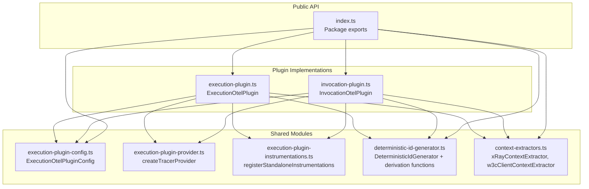
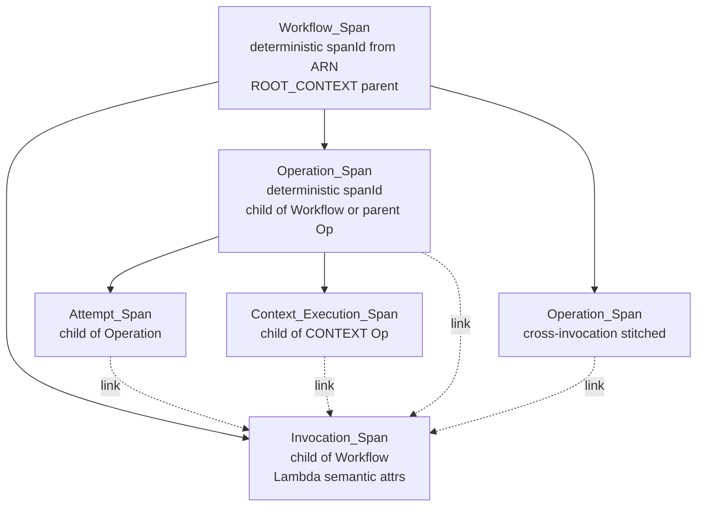

# Design Document: Execution OTel Plugin

## Overview

The `@aws/durable-execution-sdk-js-otel` package provides OpenTelemetry instrumentation for AWS Lambda durable executions. It consists of two plugin classes — `ExecutionOtelPlugin` and `InvocationOtelPlugin` — that both implement the `DurableInstrumentationPlugin` interface. The plugins produce distributed traces that stitch together multiple Lambda invocations of the same durable execution into a single coherent trace.

**Key Design Goals:**

1. **Deterministic trace stitching** — Spans from different invocations of the same execution share a single trace by using deterministic IDs derived from execution ARNs and operation IDs.
2. **Shared infrastructure** — Both plugins share configuration, TracerProvider resolution, and instrumentation registration modules to avoid duplication.
3. **Flexible deployment** — Supports standalone mode (self-managed TracerProvider with OTLP export), ADOT Lambda layer mode (global TracerProvider), and custom provider mode.
4. **Correct span hierarchy** — Produces a Workflow → Invocation → Operation → Attempt span tree with cross-invocation stitching for operations that span multiple Lambda invocations.

## Architecture



### Span Hierarchy



**Link strategy:** Operation, Attempt, and Context_Execution spans carry a span link pointing to the Invocation_Span. This correlates operations with the specific invocation that processed them, without making the Invocation_Span a parent (which would create incorrect fan-out in the trace tree). In default-provider mode, the link targets the ambient invocation span from the ADOT layer instead.

## Components and Interfaces

### Module: `execution-plugin-config.ts`

Defines the canonical configuration interface shared by both plugins.

```typescript
interface ExecutionOtelPluginConfig {
  tracerProvider?: TracerProvider;
  contextExtractor?: ContextExtractor;
  instrumentationName?: string; // default: "aws-durable-execution-sdk-js"
  enableHttpInstrumentation?: boolean; // default: true
  exporterConfig?: {
    endpoint?: string; // default: env → "http://localhost:4318/v1/traces"
    headers?: Record<string, string>;
  };
  propagators?: TextMapPropagator[]; // default: [AWSXRayPropagator, W3CTraceContextPropagator]
  useDefaultTracerProvider?: boolean; // default: false (ExecutionOtelPlugin), true (InvocationOtelPlugin)
  workflowSpanName?: string; // default: "Workflow"
}
```

**Design Decision:** A single config interface is used for both plugins. `InvocationOtelPlugin` ignores fields that only apply to `ExecutionOtelPlugin` (e.g., `workflowSpanName`). This simplifies the public API surface and enables consistent configuration across both plugins.

### Module: `execution-plugin-provider.ts`

Factory function implementing 3-level TracerProvider resolution:

```typescript
interface ProviderResult {
  tracerProvider: TracerProvider;
  ownsProvider: boolean;
}

function createTracerProvider(
  config?: ExecutionOtelPluginConfig,
): ProviderResult;
```

**Resolution Priority:**

| Priority    | Condition                                  | Result                                                            |
| ----------- | ------------------------------------------ | ----------------------------------------------------------------- |
| 1 (highest) | `config.tracerProvider` provided           | Use as-is, `ownsProvider: false`                                  |
| 2           | `config.useDefaultTracerProvider === true` | `trace.getTracerProvider()`, `ownsProvider: false`                |
| 3 (lowest)  | Neither set                                | Create `NodeTracerProvider` with auto-setup, `ownsProvider: true` |

When auto-creating (priority 3), the factory:

1. Creates `OTLPTraceExporter` targeting the resolved endpoint
2. Wraps it in `BatchSpanProcessor`
3. Resolves sampler from `OTEL_DURABLE_SAMPLING_RATIO` env var (valid 0–1 → `TraceIdRatioBasedSampler`, otherwise `AlwaysOnSampler`)
4. Builds Lambda resource attributes when `AWS_LAMBDA_FUNCTION_NAME` is set
5. Registers a `CompositePropagator` with `[AWSXRayPropagator, W3CTraceContextPropagator]` (or custom propagators)
6. Sets the global propagator

### Module: `execution-plugin-instrumentations.ts`

```typescript
function registerStandaloneInstrumentations(
  tracerProvider: TracerProvider,
  config?: ExecutionOtelPluginConfig,
): void;
```

**Behavior:**

- Skips all registration when `config.tracerProvider` or `config.useDefaultTracerProvider` is set
- Registers `HttpInstrumentation` (unless `enableHttpInstrumentation === false`) with suppression for `127.0.0.1` and `AWS_LAMBDA_RUNTIME_API` hostname
- Always registers `AwsInstrumentation` with `suppressInternalInstrumentation: true` and `sqsExtractContextPropagationFromPayload: true`

**Design Decision:** For `InvocationOtelPlugin`'s use case (default provider mode), the function still registers `AwsInstrumentation` on the global provider. The skip logic uses both `tracerProvider` and `useDefaultTracerProvider` fields to determine whether to register HTTP instrumentation, while AWS SDK instrumentation is always registered unless an explicit custom provider is given.

### Module: `deterministic-id-generator.ts`

```typescript
class DeterministicIdGenerator implements IdGenerator {
  setTraceId(traceId: string): void; // persistent until next call
  setNextSpanId(spanId: string): void; // one-shot, consumed on next generateSpanId()
  generateTraceId(): string; // returns set traceId or random fallback
  generateSpanId(): string; // returns next spanId if set, else random fallback
}

function deriveTraceIdFromArn(executionArn: string): string; // SHA-256 → 32 hex chars
function deriveTraceIdFromXRayRoot(xRayRoot: string): string | undefined; // strip prefix/dashes → 32 hex
function deriveWorkflowSpanId(executionArn: string): string; // SHA-256("workflow:" + arn) → 16 hex
function deriveSpanIdFromOperationId(
  operationId: string,
  executionArn: string,
): string; // SHA-256(arn + ":" + id) → 16 hex
```

**Deterministic ID Strategy:**

| Span Type          | ID Derivation                                              |
| ------------------ | ---------------------------------------------------------- |
| Trace ID           | X-Ray Root field (stripped) or SHA-256(executionArn)[0:32] |
| Workflow_Span ID   | SHA-256("workflow:" + executionArn)[0:16]                  |
| Operation_Span ID  | SHA-256(executionArn + ":" + operationId)[0:16]            |
| Invocation_Span ID | Random (non-deterministic, per-invocation)                 |
| Attempt_Span ID    | Random (non-deterministic, per-attempt)                    |

The `executionArn` is included in operation span ID derivation to prevent collisions when multiple executions (e.g., parent and child workflows) share the same trace and have operations at the same positional index.

The all-zeros span ID (`0000000000000000`) is a reserved invalid value in OpenTelemetry. `deriveWorkflowSpanId` guards against this by returning `0000000000000001` in the astronomically unlikely case of an all-zeros hash output.

### Module: `context-extractors.ts`

```typescript
type ContextExtractorResult =
  | { traceId: string; parentSpanId?: string; traceFlags?: number }
  | undefined;
type ContextExtractor = (info: InvocationInfo) => ContextExtractorResult;

function xRayContextExtractor(info: InvocationInfo): ContextExtractorResult;
function w3cClientContextExtractor(
  info: InvocationInfo,
): ContextExtractorResult;
```

**xRayContextExtractor** reads `_X_AMZN_TRACE_ID` environment variable, parses `Root` (→ traceId) and `Parent` (→ parentSpanId) fields. Returns `undefined` if the env var is missing or malformed.

**w3cClientContextExtractor** reads W3C `traceparent` from `info.context.clientContext.custom.traceparent`, parsing the `version-traceId-parentId-flags` format. Returns `undefined` if any path element is missing or the format is invalid.

### Module: `execution-plugin.ts` — ExecutionOtelPlugin

Self-contained plugin that manages its own TracerProvider. Key internal state:

```typescript
class ExecutionOtelPlugin implements DurableInstrumentationPlugin {
  // Shared utilities
  private idGenerator: DeterministicIdGenerator;
  private contextExtractor: ContextExtractor;

  // TracerProvider management
  private tracerProvider: TracerProvider;
  private tracer: Tracer;
  private ownsProvider: boolean;

  // Per-invocation state (cleared in onInvocationEnd)
  private workflowSpan: Span | undefined;
  private invocationSpan: Span | undefined;
  private spanMap: Map<string, Span>;
  private executionArn: string;
  private attemptSpan: Span | undefined;
  private savedInvocationContext: Context | undefined;

  // Lifecycle flags
  private isColdStart: boolean;
  private useDefaultTracerProvider: boolean;
  private workflowSpanName: string;
}
```

**Lifecycle Flow:**

1. **Construction** — Creates/obtains TracerProvider via `createTracerProvider`, registers instrumentations via `registerStandaloneInstrumentations`, obtains Tracer, monkey-patches `_idGenerator`.
2. **onInvocationStart** — Extracts trace context, sets deterministic trace ID and workflow span ID, creates Workflow_Span (ROOT_CONTEXT), creates Invocation_Span (if not default-provider mode).
3. **wrapInvocation** — Sets Workflow_Span as active context for the execution function.
4. **onOperationStart** — Creates Operation_Span with deterministic ID, resolves parent (parentId → SpanMap → Workflow_Span), adds invocation links.
5. **wrapChildContextFn** — For CONTEXT ops: creates Context_Execution_Span via `startActiveSpan`. For others: sets operation span as active context.
6. **onOperationEnd** — Ends span if in SpanMap; otherwise creates cross-invocation stitched span with same deterministic ID and immediately ends it.
7. **onOperationAttemptStart/End** — Creates/ends Attempt_Span as child of Operation_Span.
8. **wrapOperationAttemptFn** — Sets Attempt_Span as active context.
9. **onInvocationEnd** — Ends Invocation_Span, conditionally ends Workflow_Span (terminal) or drops reference (non-terminal), calls `forceFlush`, clears all per-invocation state.

### Module: `invocation-plugin.ts` — InvocationOtelPlugin

Simpler plugin designed for use with external auto-instrumentation (ADOT Lambda layer). Key differences from ExecutionOtelPlugin:

| Aspect                           | ExecutionOtelPlugin                                  | InvocationOtelPlugin                                    |
| -------------------------------- | ---------------------------------------------------- | ------------------------------------------------------- |
| TracerProvider                   | Self-managed (default)                               | Global (default)                                        |
| Workflow_Span                    | Creates as trace root                                | Does not create                                         |
| Invocation_Span                  | Creates as child of Workflow                         | Creates as trace root                                   |
| Operation parent                 | Workflow_Span                                        | Invocation_Span                                         |
| Cross-invocation stitching       | Creates span with deterministic ID, ends immediately | Creates continuation span with link to deterministic ID |
| Replay handling                  | Always creates spans (no replay distinction)         | Skips certain ops on replay                             |
| Span deferred export             | Workflow_Span only exported on terminal status       | All spans exported immediately                          |
| useDefaultTracerProvider default | `false`                                              | `true`                                                  |

`InvocationOtelPlugin` reuses the shared modules:

- `DeterministicIdGenerator` for consistent trace/span IDs
- `createTracerProvider` for provider resolution (defaulting `useDefaultTracerProvider: true`)
- `registerStandaloneInstrumentations` for AWS SDK instrumentation on the global provider
- `xRayContextExtractor` as default context extractor

### Module: `index.ts` — Package Exports

```typescript
// Plugin classes
export { ExecutionOtelPlugin } from "./execution-plugin";
export { InvocationOtelPlugin } from "./invocation-plugin";

// Configuration types
export type { ExecutionOtelPluginConfig } from "./execution-plugin-config";
export type { InvocationOtelPluginConfig } from "./invocation-plugin"; // deprecated

// ID utilities
export {
  DeterministicIdGenerator,
  deriveTraceIdFromXRayRoot,
  deriveTraceIdFromArn,
  deriveSpanIdFromOperationId,
  deriveWorkflowSpanId,
} from "./deterministic-id-generator";

// Context extractors
export {
  xRayContextExtractor,
  w3cClientContextExtractor,
} from "./context-extractors";
export type {
  ContextExtractor,
  ContextExtractorResult,
} from "./context-extractors";
```

## Data Models

### Span Attributes

| Attribute                   | Type    | Applied To                            | Description                        |
| --------------------------- | ------- | ------------------------------------- | ---------------------------------- |
| `durable.execution.arn`     | string  | All spans                             | Execution ARN identifier           |
| `durable.execution.status`  | string  | Workflow_Span                         | Terminal status (SUCCEEDED/FAILED) |
| `durable.operation.id`      | string  | Operation, Attempt, Context_Execution | Positional operation identifier    |
| `durable.operation.type`    | string  | Operation, Attempt, Context_Execution | Operation type (STEP, WAIT, etc.)  |
| `durable.operation.name`    | string  | Operation, Attempt, Context_Execution | User-provided operation name       |
| `durable.operation.subtype` | string  | Operation, Attempt                    | Operation subtype                  |
| `durable.operation.attempt` | number  | Attempt                               | 1-based attempt number             |
| `durable.attempt.outcome`   | string  | Attempt                               | SUCCEEDED or FAILED                |
| `faas.invocation_id`        | string  | Invocation                            | Lambda request ID                  |
| `faas.coldstart`            | boolean | Invocation                            | Whether this is a cold start       |
| `faas.max_memory`           | number  | Invocation                            | Lambda memory size (MB)            |
| `cloud.provider`            | string  | Invocation                            | "aws"                              |
| `cloud.platform`            | string  | Invocation                            | "aws_lambda"                       |
| `cloud.resource_id`         | string  | Invocation                            | Lambda function ARN                |

### Per-Invocation State

| Field                    | Type                   | Lifecycle                                                                                          |
| ------------------------ | ---------------------- | -------------------------------------------------------------------------------------------------- |
| `workflowSpan`           | `Span \| undefined`    | Set in `onInvocationStart`, cleared in `onInvocationEnd`                                           |
| `invocationSpan`         | `Span \| undefined`    | Set in `onInvocationStart`, cleared in `onInvocationEnd`                                           |
| `spanMap`                | `Map<string, Span>`    | Entries added in `onOperationStart`, removed in `onOperationEnd`, map cleared in `onInvocationEnd` |
| `executionArn`           | `string`               | Set in `onInvocationStart`, reset to `""` in `onInvocationEnd`                                     |
| `attemptSpan`            | `Span \| undefined`    | Set in `onOperationAttemptStart`, cleared in `onOperationAttemptEnd` and `onInvocationEnd`         |
| `savedInvocationContext` | `Context \| undefined` | Set in `onInvocationStart` (default-provider mode only), cleared in `onInvocationEnd`              |

## Correctness Properties

_A property is a characteristic or behavior that should hold true across all valid executions of a system — essentially, a formal statement about what the system should do. Properties serve as the bridge between human-readable specifications and machine-verifiable correctness guarantees._

### Property 1: setTraceId persistence

_For any_ valid 32-character hex string `t`, after calling `setTraceId(t)`, every subsequent call to `generateTraceId()` SHALL return `t` until `setTraceId` is called again with a different value.

**Validates: Requirements 5.2**

### Property 2: setNextSpanId one-shot consumption

_For any_ valid 16-character hex string `s`, after calling `setNextSpanId(s)`, exactly the next call to `generateSpanId()` SHALL return `s`, and all subsequent calls (without another `setNextSpanId`) SHALL NOT return `s`.

**Validates: Requirements 5.3**

### Property 3: Fallback ID format validity

_For any_ call to `generateTraceId()` when no traceId is set, the result SHALL be a valid 32-character lowercase hex string. _For any_ call to `generateSpanId()` when no nextSpanId is set, the result SHALL be a valid 16-character lowercase hex string.

**Validates: Requirements 5.4, 5.5**

### Property 4: deriveTraceIdFromArn deterministic correctness

_For any_ non-empty string `arn`, `deriveTraceIdFromArn(arn)` SHALL return the first 32 characters of the lowercase hex SHA-256 digest of `arn`.

**Validates: Requirements 6.1**

### Property 5: deriveTraceIdFromXRayRoot transformation

_For any_ valid X-Ray Root string of the form `"1-{8hexchars}-{24hexchars}"` (with optional `"Root="` prefix), `deriveTraceIdFromXRayRoot` SHALL return a 32-character lowercase hex string equal to the concatenation of the 8-char and 24-char segments. _For any_ string that does not conform to the `"1-"` prefix format after stripping, the function SHALL return `undefined`.

**Validates: Requirements 6.2, 6.3, 6.4, 6.5**

### Property 6: deriveWorkflowSpanId deterministic correctness

_For any_ non-empty string `arn`, `deriveWorkflowSpanId(arn)` SHALL return the first 16 characters of the lowercase hex SHA-256 digest of `"workflow:" + arn`, unless that value is `"0000000000000000"`, in which case it SHALL return `"0000000000000001"`.

**Validates: Requirements 7.1, 7.2**

### Property 7: deriveSpanIdFromOperationId deterministic correctness

_For any_ pair of strings `(arn, operationId)`, `deriveSpanIdFromOperationId(operationId, arn)` SHALL return the first 16 characters of the lowercase hex SHA-256 digest of `arn + ":" + operationId`. Furthermore, _for any_ two distinct ARNs `arn1 ≠ arn2` and same `operationId`, the outputs SHALL differ (with cryptographic certainty from SHA-256).

**Validates: Requirements 7.4, 7.5**

### Property 8: X-Ray context extractor parsing correctness

_For any_ valid X-Ray trace header of the form `"Root=1-{8hex}-{24hex};Parent={16hex};Sampled=1"`, `xRayContextExtractor` SHALL return a result where `traceId` equals the concatenation of the 8-char and 24-char Root segments (32 hex chars), and `parentSpanId` equals the 16-char Parent value. _For any_ header missing the Root field or producing a non-32-char-hex traceId, the extractor SHALL return `undefined`.

**Validates: Requirements 8.3, 8.4, 8.5**

### Property 9: W3C traceparent parsing correctness

_For any_ valid W3C traceparent string of the form `"{2hex}-{32hex}-{16hex}-{2hex}"`, `w3cClientContextExtractor` SHALL return a result where `traceId` equals the 32-hex segment, `parentSpanId` equals the 16-hex segment, and `traceFlags` equals the integer value of the 2-hex flags segment.

**Validates: Requirements 8.7**

### Property 10: Sampler resolution from environment variable

_For any_ string value of `OTEL_DURABLE_SAMPLING_RATIO` that parses to a number `r` where `0 ≤ r ≤ 1`, the resolved sampler SHALL be a `TraceIdRatioBasedSampler` with ratio `r`. _For any_ value that is empty, non-numeric, or outside [0, 1], the resolved sampler SHALL be an `AlwaysOnSampler`.

**Validates: Requirements 3.4, 3.5**

### Property 11: Operation span name resolution

_For any_ OperationInfo where `name` is a non-empty string, the created span's name SHALL equal `name`. _For any_ OperationInfo where `name` is undefined or empty, the created span's name SHALL equal the `type` field.

**Validates: Requirements 14.2**

### Property 12: Per-invocation state cleanup invariant

_For any_ sequence of lifecycle calls (onInvocationStart, onOperationStart, onOperationEnd, etc.) followed by `onInvocationEnd`, all per-invocation state SHALL be cleared: `spanMap` is empty, `workflowSpan` is undefined, `invocationSpan` is undefined, `savedInvocationContext` is undefined, `executionArn` is empty string, and `attemptSpan` is undefined.

**Validates: Requirements 21.1, 21.2, 21.3, 21.4, 21.5, 21.6**

### Property 13: enrichLogContext extraction correctness

_For any_ active span with `spanContext()` returning `{traceId: t, spanId: s, traceFlags: f}`, `enrichLogContext()` SHALL return `{traceId: t, spanId: s, otelTraceSampled: (f & 1) !== 0}`. _When_ no span is active, it SHALL return `undefined`.

**Validates: Requirements 23.1, 23.2, 23.3, 23.4**

## Error Handling

| Scenario                                                   | Behavior                                                                                                         |
| ---------------------------------------------------------- | ---------------------------------------------------------------------------------------------------------------- |
| `forceFlush()` throws during `onInvocationEnd`             | Error is caught, logged to `console.error`, invocation continues normally                                        |
| Context extractor returns `undefined`                      | Plugin falls back to `deriveTraceIdFromArn(executionArn)` for trace ID                                           |
| `deriveWorkflowSpanId` receives empty string               | Throws `Error("Execution ARN must be non-empty")`                                                                |
| Operation span creation fails (tracer error)               | Operation is not added to SpanMap; subsequent `onOperationEnd` creates a fresh cross-invocation span             |
| `onInvocationEnd` called without prior `onInvocationStart` | All state fields are already in initial state; no-op gracefully                                                  |
| Plugin hook throws/rejects                                 | SDK catches and swallows the error (per DurableInstrumentationPlugin contract) — never affects execution outcome |
| TracerProvider missing `forceFlush` method                 | Flush is skipped; state cleanup still proceeds                                                                   |
| `OTEL_DURABLE_SAMPLING_RATIO` set to invalid value         | Silently falls back to `AlwaysOnSampler`                                                                         |
| Monkey-patched `_idGenerator` field absent on tracer       | Assignment is a no-op (property set on object); spans will use random IDs as fallback                            |

## Testing Strategy

### Property-Based Tests (fast-check)

The package already includes `fast-check` as a dev dependency. Property-based tests will validate the correctness properties above with a minimum of 100 iterations each.

**Library:** `fast-check` (v3.23.2+)
**Runner:** Jest (v30+)
**Minimum iterations:** 100 per property

Each property test must be tagged with a comment referencing the design property:

```typescript
// Feature: execution-otel-plugin, Property 4: deriveTraceIdFromArn deterministic correctness
```

**Target modules for PBT:**

- `deterministic-id-generator.ts` — Properties 1–7 (ID generation, derivation functions)
- `context-extractors.ts` — Properties 8–9 (parsing correctness)
- `execution-plugin-provider.ts` — Property 10 (sampler resolution)
- `execution-plugin.ts` — Properties 11–13 (span naming, state cleanup, log context)

### Unit Tests (Jest)

Unit tests cover specific examples, integration points, and edge cases not suitable for PBT:

- **Plugin interface compliance** (Req 1) — Verify all hooks exist with correct signatures
- **TracerProvider resolution priority** (Req 2) — Three scenarios: custom, global, auto-created
- **Auto-configured provider setup** (Req 3) — Endpoint resolution, resource attributes, propagator registration
- **Instrumentation registration** (Req 4) — Skip conditions, HTTP suppression, AWS SDK config
- **Workflow span lifecycle** (Req 9) — Terminal vs non-terminal end behavior, ROOT_CONTEXT
- **Invocation span management** (Req 10–11) — Cold start, attributes, default-provider mode skip
- **Operation span hierarchy** (Req 14) — Parent resolution with parentId, fallback to Workflow
- **Cross-invocation stitching** (Req 15) — Span created with deterministic ID when not in SpanMap
- **Attempt span lifecycle** (Req 16–17) — Creation, attributes, outcome, context propagation
- **CONTEXT operation wrapping** (Req 18) — startActiveSpan usage, Context_Execution_Span
- **Span links strategy** (Req 19) — Default-provider mode links, explicit invocation links
- **Default provider mode** (Req 20) — Ambient context capture, no Invocation_Span
- **Configuration defaults** (Req 24) — All default values verified
- **Shared module structure** (Req 25–28) — Both plugins use shared modules, no circular deps

### Test Organization

```
tests/
├── unit/
│   ├── execution-plugin.test.ts
│   ├── invocation-plugin.test.ts
│   ├── execution-plugin-provider.test.ts
│   ├── execution-plugin-instrumentations.test.ts
│   └── context-extractors.test.ts
└── property/
    ├── deterministic-id-generator.property.test.ts
    ├── context-extractors.property.test.ts
    ├── sampler-resolution.property.test.ts
    └── plugin-invariants.property.test.ts
```

### Testing Approach Balance

- **Property tests** validate universal correctness across large input spaces (ID generation, parsing, invariants)
- **Unit tests** validate specific scenarios, integration wiring, and lifecycle sequencing
- **Both together** provide comprehensive coverage: property tests catch subtle edge cases that unit tests miss, while unit tests verify the specific integration behaviors that property tests cannot easily express
