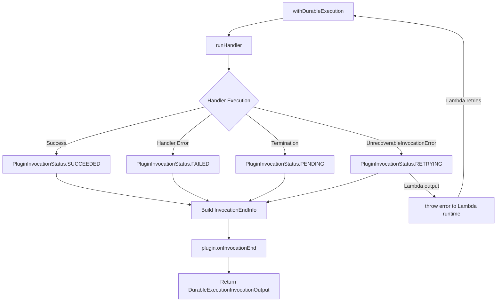
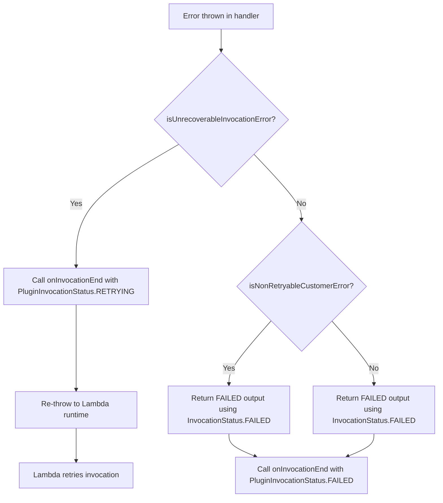

# Design Document: Invocation Status Plugin Hook

## Overview

This feature refactors the plugin hook lifecycle in the AWS Durable Execution SDK (JS/TS) to consolidate execution-end information into the `onInvocationEnd` hook. The `onExecutionEnd` hook is removed, and a new `InvocationEndInfo` interface replaces `InvocationInfo` as the parameter for `onInvocationEnd`. A new `PluginInvocationStatus` enum is introduced in `src/types/plugin.ts` with four members (SUCCEEDED, FAILED, PENDING, RETRYING), providing richer status information to plugin authors without modifying the existing `InvocationStatus` enum in `src/types/core.ts`.

### Key Design Decisions

1. **Consolidation over separate hooks**: Rather than maintaining two hooks (`onExecutionEnd` + `onInvocationEnd`), a single `onInvocationEnd` with richer info reduces complexity for plugin authors and ensures they always receive complete invocation context.

2. **Separate PluginInvocationStatus enum**: Instead of modifying the existing `InvocationStatus` in `core.ts`, a new `PluginInvocationStatus` enum is defined in `plugin.ts`. This cleanly separates plugin-facing status semantics from the Lambda runtime contract. The core `InvocationStatus` (3 members) remains untouched.

3. **RETRYING is plugin-only**: The `PluginInvocationStatus.RETRYING` status is exclusively for the `InvocationEndInfo` parameter passed to plugins. It never appears in `DurableExecutionInvocationOutput` returned to the Lambda runtime, preserving the service contract.

4. **Error isolation maintained**: `onInvocationEnd` continues to use fire-and-forget error suppression, ensuring faulty plugins never affect SDK behavior or the invocation output.

## Architecture



The architecture change replaces the current two-step notification (`onExecutionEnd` then `onInvocationEnd`) with a single `onInvocationEnd` call that carries all the information previously split across both hooks.

### Current Flow (Before)

1. Handler completes → `onExecutionEnd(ExecutionEndInfo)` called for SUCCEEDED/FAILED
2. In `finally` block → `onInvocationEnd(InvocationInfo)` called (minimal info)

### New Flow (After)

1. Handler completes → Build `InvocationEndInfo` with `PluginInvocationStatus` + context
2. Call `onInvocationEnd(InvocationEndInfo)` once with full details
3. Return `DurableExecutionInvocationOutput` (uses core `InvocationStatus` — never contains RETRYING)

## Components and Interfaces

### PluginInvocationStatus Enum (New — in `src/types/plugin.ts`)

```typescript
/**
 * Status enumeration for plugin invocation end hooks.
 *
 * This enum is separate from the core InvocationStatus and provides
 * richer status information for plugin authors, including a RETRYING
 * state that indicates the Lambda runtime will automatically retry.
 *
 * @experimental This enum is experimental and may be changed or removed in future releases.
 */
export enum PluginInvocationStatus {
  SUCCEEDED = "SUCCEEDED",
  FAILED = "FAILED",
  PENDING = "PENDING",
  RETRYING = "RETRYING",
}
```

The `RETRYING` member indicates that the current invocation encountered an `UnrecoverableInvocationError` and the Lambda runtime will automatically retry. This status is used only within plugin hook parameters (`InvocationEndInfo`).

### InvocationStatus Enum (Unchanged — in `src/types/core.ts`)

The existing `InvocationStatus` enum remains exactly as-is with 3 members:

```typescript
export enum InvocationStatus {
  SUCCEEDED = "SUCCEEDED",
  FAILED = "FAILED",
  PENDING = "PENDING",
}
```

This enum continues to be used exclusively in `DurableExecutionInvocationOutput` for the Lambda runtime contract.

### InvocationEndInfo Interface (New — in `src/types/plugin.ts`)

```typescript
import { Operation } from "@aws-sdk/client-lambda";

export interface InvocationEndInfo extends InvocationInfo {
  status: PluginInvocationStatus;
  executionResult?: unknown;
  executionError?: Error;
  executionInput: unknown;
  operations: Record<string, Operation>;
}
```

Field semantics by status:

| Status    | `executionResult`    | `executionError`                 | `executionInput` | `operations`   |
| --------- | -------------------- | -------------------------------- | ---------------- | -------------- |
| SUCCEEDED | Handler return value | `undefined`                      | Customer event   | All operations |
| FAILED    | `undefined`          | The caught Error                 | `undefined`      | All operations |
| PENDING   | `undefined`          | `undefined`                      | Customer event   | All operations |
| RETRYING  | `undefined`          | The UnrecoverableInvocationError | Customer event   | All operations |

### DurableInstrumentationPlugin Interface (Modified — in `src/types/plugin.ts`)

```typescript
export interface DurableInstrumentationPlugin {
  // REMOVED: onExecutionEnd?(info: ExecutionEndInfo): void;
  onInvocationStart?(info: InvocationInfo): void;
  wrapInvocation?(
    info: InvocationInfo,
    fn: () => Promise<DurableExecutionInvocationOutput>,
  ): Promise<DurableExecutionInvocationOutput>;
  onInvocationEnd?(info: InvocationEndInfo): void; // Changed: accepts InvocationEndInfo (uses PluginInvocationStatus)
  onOperationFirstStart?(info: OperationInfo): void;
  onOperationStart?(info: OperationInfo): void;
  wrapChildContextFn?(info: OperationInfo, fn: CustomerFn): CustomerFnResult;
  onOperationFirstEnd?(info: OperationEndInfo): void;
  onOperationAttemptStart?(info: AttemptInfo): void;
  wrapOperationAttemptFn?(info: AttemptInfo, fn: CustomerFn): CustomerFnResult;
  onOperationAttemptEnd?(info: AttemptEndInfo): void;
  onOperationChange?(info: OperationChangeInfo): void;
  enrichLogContext?(): Record<string, string | number | boolean> | undefined;
}
```

### DurableExecutionInvocationOutput (Unchanged — in `src/types/core.ts`)

The output type's `Status` field remains a union of `SUCCEEDED | FAILED | PENDING` only, using the original `InvocationStatus` enum (3 members). The TypeScript type system enforces that `RETRYING` cannot appear in the Lambda response:

```typescript
export type DurableExecutionInvocationOutput =
  | DurableExecutionInvocationOutputSucceeded // Status: InvocationStatus.SUCCEEDED
  | DurableExecutionInvocationOutputFailed // Status: InvocationStatus.FAILED
  | DurableExecutionInvocationOutputPending; // Status: InvocationStatus.PENDING
```

### Plugin Runner Changes

The `createPluginRunner` function will:

1. Remove the `onExecutionEnd` dispatch method entirely
2. Update `onInvocationEnd` dispatch to accept `InvocationEndInfo` instead of `InvocationInfo`
3. Continue using the fire-and-forget `run` dispatch pattern for `onInvocationEnd` (errors suppressed, all plugins called)

### with-durable-execution.ts Changes

The main orchestration file will:

1. Remove all `plugin.onExecutionEnd?.(...)` call sites (3 locations)
2. Move the `onInvocationEnd` call from the `finally` block into each outcome branch, passing a fully-constructed `InvocationEndInfo` with `PluginInvocationStatus`
3. Add a new `catch` block for `UnrecoverableInvocationError` that calls `onInvocationEnd` with `PluginInvocationStatus.RETRYING` before re-throwing the error
4. Ensure `onInvocationEnd` is called exactly once per invocation regardless of the code path
5. Continue using `InvocationStatus` (from core.ts) for `DurableExecutionInvocationOutput.Status` values

## Data Models

### Type Exports (index.ts)

The public API surface changes:

- **Added**: `InvocationEndInfo` export (from `./types/plugin`)
- **Added**: `PluginInvocationStatus` export (from `./types/plugin`)
- **Removed**: `ExecutionEndInfo` export
- **Unchanged**: `InvocationStatus` (still exported from `./types/core` with 3 members)

```typescript
export {
  DurableInstrumentationPlugin,
  InvocationInfo,
  InvocationEndInfo, // NEW
  PluginInvocationStatus, // NEW
  // ExecutionEndInfo,         // REMOVED
  OperationChangeInfo,
  OperationInfo,
  OperationEndInfo,
  AttemptInfo,
  AttemptEndInfo,
  AttemptEndInfoOutcome,
} from "./types/plugin";
```

### Status Determination Logic

```typescript
import { PluginInvocationStatus } from "./types/plugin";

function determinePluginInvocationStatus(
  outcome: InvocationOutcome,
): PluginInvocationStatus {
  // SUCCEEDED: handler returned normally
  // FAILED: handler threw a recoverable/non-retryable error
  // PENDING: termination occurred (checkpoint, wait, callback)
  // RETRYING: UnrecoverableInvocationError (checkpoint failure causing Lambda retry)
}
```

### Enum Relationship Diagram

```mermaid
graph LR
    subgraph "src/types/core.ts (UNCHANGED)"
        IS[InvocationStatus<br/>SUCCEEDED | FAILED | PENDING]
    end

    subgraph "src/types/plugin.ts (NEW)"
        PIS[PluginInvocationStatus<br/>SUCCEEDED | FAILED | PENDING | RETRYING]
    end

    subgraph "Usage"
        OUT[DurableExecutionInvocationOutput.Status] -->|uses| IS
        IEI[InvocationEndInfo.status] -->|uses| PIS
    end
```

## Correctness Properties

_A property is a characteristic or behavior that should hold true across all valid executions of a system — essentially, a formal statement about what the system should do. Properties serve as the bridge between human-readable specifications and machine-verifiable correctness guarantees._

### Property 1: Successful invocation produces correct InvocationEndInfo

_For any_ handler that returns a value successfully, `onInvocationEnd` SHALL be called with `status` equal to `PluginInvocationStatus.SUCCEEDED`, `executionResult` equal to the handler's return value, and `executionError` equal to `undefined`.

**Validates: Requirements 2.4, 3.2**

### Property 2: Failed invocation produces correct InvocationEndInfo

_For any_ handler that throws a non-unrecoverable error, `onInvocationEnd` SHALL be called with `status` equal to `PluginInvocationStatus.FAILED`, `executionError` set to the thrown Error instance, and `executionResult` equal to `undefined`.

**Validates: Requirements 2.5, 3.3**

### Property 3: Retrying invocation produces correct InvocationEndInfo

_For any_ `UnrecoverableInvocationError` thrown during execution, `onInvocationEnd` SHALL be called with `status` equal to `PluginInvocationStatus.RETRYING`, `executionError` set to the thrown error, and `executionResult` equal to `undefined`.

**Validates: Requirements 2.7, 3.5**

### Property 4: executionInput preservation

_For any_ deserialized customer handler event, the `InvocationEndInfo.executionInput` field passed to `onInvocationEnd` SHALL equal the original deserialized event, regardless of invocation outcome.

**Validates: Requirements 2.8**

### Property 5: onInvocationEnd called exactly once

_For any_ invocation outcome (SUCCEEDED, FAILED, PENDING, or RETRYING), `onInvocationEnd` SHALL be called exactly once per invocation.

**Validates: Requirements 3.6**

### Property 6: Plugin error isolation in onInvocationEnd

_For any_ set of registered plugins where one or more plugins throw synchronous errors or return rejected promises from `onInvocationEnd`, all subsequent plugins SHALL still receive their `onInvocationEnd` call, and the `DurableExecutionInvocationOutput` returned by the SDK SHALL be identical to the output determined before `onInvocationEnd` dispatch.

**Validates: Requirements 5.1, 5.2, 5.3, 5.4**

### Property 7: RETRYING never appears in Lambda response output

_For any_ invocation outcome, the `DurableExecutionInvocationOutput.Status` returned to the Lambda runtime SHALL be one of `InvocationStatus.SUCCEEDED`, `InvocationStatus.FAILED`, or `InvocationStatus.PENDING` (from `core.ts`), and SHALL never contain the value `"RETRYING"`.

**Validates: Requirements 6.1, 6.2, 6.3, 6.4**

## Error Handling

### Plugin Errors in onInvocationEnd

The `run` dispatch function in `plugin-runner.ts` handles errors for `onInvocationEnd`:

1. **Synchronous errors**: Caught in a try/catch around each plugin's hook call. The error is swallowed, and iteration continues to the next plugin.
2. **Async rejections**: If the hook returns a promise-like value, `.catch(() => {})` is attached to suppress unhandled rejections. The SDK does not `await` the result.
3. **Guarantee**: The invocation output is determined _before_ `onInvocationEnd` is dispatched, so no plugin behavior can alter it.

### UnrecoverableInvocationError Handling

When an `UnrecoverableInvocationError` is caught:

1. `onInvocationEnd` is called with `PluginInvocationStatus.RETRYING` and the error
2. The error is then re-thrown to the Lambda runtime, which triggers a retry
3. The error is NOT caught by the outer `withDurableExecution` wrapper's non-retryable check

### Error Flow Diagram



## Testing Strategy

### Property-Based Testing

This feature is suitable for property-based testing because:

- The plugin hook behavior must hold universally across all possible handler outputs, error types, and plugin behaviors
- Input space is large: arbitrary handler return values, various error types, multiple plugin configurations
- Pure logic can be tested with mocks (no external services)

**Library**: [fast-check](https://github.com/dubzzz/fast-check) (already available in the project's test toolchain via Jest)

**Configuration**: Minimum 100 iterations per property test.

**Tag format**: `Feature: invocation-status-plugin-hook, Property {number}: {property_text}`

### Unit Tests (Example-Based)

- Verify `PluginInvocationStatus` enum has exactly 4 members with correct string values
- Verify `InvocationStatus` enum in core.ts remains unchanged with exactly 3 members
- Verify `InvocationEndInfo` extends `InvocationInfo` (structural type check)
- Verify `onExecutionEnd` is not present on the plugin runner
- Verify PENDING status has undefined executionResult and executionError
- Verify the SDK compiles without TypeScript errors
- Verify `PluginInvocationStatus` and `InvocationStatus` are distinct types (different object references)

### Integration Tests

- Full lifecycle test: multiple plugins receiving `onInvocationEnd` with correct `InvocationEndInfo` across all status paths
- Backward compatibility: existing plugins that don't implement `onInvocationEnd` continue to work
- Verify that removing `onExecutionEnd` from existing plugin implementations doesn't cause errors
- Verify `DurableExecutionInvocationOutput` continues to use `InvocationStatus` from core.ts (not `PluginInvocationStatus`)
