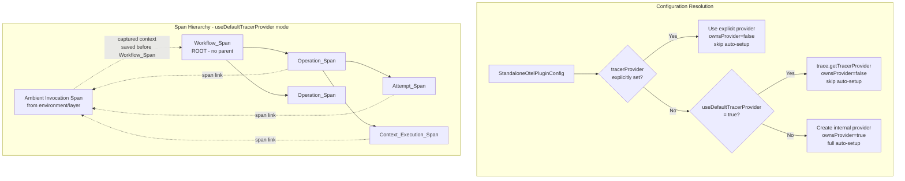

# Design Document: Use Default Tracer Provider in StandaloneOtelPlugin

## Overview

This feature extends the `StandaloneOtelPlugin` with a `useDefaultTracerProvider` configuration option that allows the plugin to use the globally registered OpenTelemetry `TracerProvider` (fetched via `trace.getTracerProvider()`) instead of creating its own internal provider.

When enabled, the plugin skips all auto-setup (OTLP exporter, propagators, instrumentations) and delegates provider lifecycle management to the caller. The plugin still applies its deterministic ID generator to the tracer and maintains its span hierarchy semantics (Workflow_Span as root, operation/attempt spans as children), but replaces the explicit Invocation_Span with a captured ambient context that is linked via span links on child spans.

**Key design decisions:**

1. The Workflow_Span remains a root span (created with `ROOT_CONTEXT`) to keep the durable execution trace tree self-contained.
2. The ambient invocation span (from the environment/layer) is captured and linked via span links on Operation_Spans, Attempt_Spans, and Context_Execution_Spans — not on the Workflow_Span itself.
3. `forceFlush()` is always called at invocation boundaries (regardless of provider ownership) to ensure spans are exported before Lambda freezes.
4. `shutdown()` is never called on providers the plugin doesn't own.

## Architecture



### Provider Resolution Precedence

The provider resolution follows a strict priority order:

1. **Explicit `tracerProvider`** — highest priority. When set, both `useDefaultTracerProvider` and auto-setup are ignored.
2. **`useDefaultTracerProvider: true`** — retrieves the globally registered provider via `trace.getTracerProvider()`.
3. **Default behavior** — creates and manages its own internal `NodeTracerProvider` with full auto-setup (exporter, propagators, sampler, instrumentations).

## Components and Interfaces

### Modified Interface: `StandaloneOtelPluginConfig`

```typescript
export interface StandaloneOtelPluginConfig {
  // ... existing fields unchanged ...

  /**
   * When true, the plugin fetches the globally registered TracerProvider
   * via trace.getTracerProvider() instead of creating its own.
   *
   * This skips all auto-setup (exporter, propagators, instrumentations).
   * The caller is responsible for configuring the global provider.
   *
   * Precedence: explicit tracerProvider > useDefaultTracerProvider > auto-created.
   * If both tracerProvider and useDefaultTracerProvider are set, tracerProvider wins.
   *
   * Defaults to false.
   */
  useDefaultTracerProvider?: boolean;
}
```

### Modified Function: `createTracerProvider`

The `createTracerProvider` factory in `standalone-plugin-provider.ts` gains a new branch:

```typescript
export function createTracerProvider(
  config?: StandaloneOtelPluginConfig,
): ProviderResult {
  // Priority 1: Explicit custom provider
  if (config?.tracerProvider) {
    return { tracerProvider: config.tracerProvider, ownsProvider: false };
  }

  // Priority 2: Use globally registered default provider
  if (config?.useDefaultTracerProvider) {
    return { tracerProvider: trace.getTracerProvider(), ownsProvider: false };
  }

  // Priority 3: Create internal provider with full auto-setup
  // ... existing logic unchanged ...
}
```

### Modified Function: `registerStandaloneInstrumentations`

The guard condition expands to also check `useDefaultTracerProvider`:

```typescript
export function registerStandaloneInstrumentations(
  tracerProvider: TracerProvider,
  config?: StandaloneOtelPluginConfig,
): void {
  // Skip when using external provider (explicit or default)
  if (config?.tracerProvider || config?.useDefaultTracerProvider) {
    return;
  }
  // ... existing registration logic unchanged ...
}
```

### Modified Class: `StandaloneOtelPlugin`

New instance field:

```typescript
private savedInvocationContext: Context | undefined;
```

#### Constructor Changes

No changes beyond what `createTracerProvider` and `registerStandaloneInstrumentations` already handle — the deterministic ID generator is still monkey-patched onto the tracer regardless of provider source.

#### `onInvocationStart` Changes

When `useDefaultTracerProvider` is active:

1. **Capture ambient context** — save `context.active()` which holds the invocation span from the environment/layer.
2. **Create Workflow_Span as root** — use `ROOT_CONTEXT` as the parent context (same as current behavior).
3. **Skip Invocation_Span creation** — no explicit Invocation_Span is created; the ambient span serves this role.

```typescript
async onInvocationStart(info: InvocationInfo): Promise<void> {
  this.executionArn = info.executionArn;

  // Extract trace context
  const extractedContext = this.contextExtractor(info);
  if (extractedContext?.traceId) {
    this.idGenerator.setTraceId(extractedContext.traceId);
  } else {
    this.idGenerator.setTraceId(deriveTraceIdFromArn(info.executionArn));
  }

  // Save the ambient invocation context BEFORE creating Workflow_Span
  if (this.useDefaultTracerProvider) {
    this.savedInvocationContext = context.active();
  }

  // Create Workflow_Span as root (ROOT_CONTEXT — no parent)
  const workflowSpanId = deriveWorkflowSpanId(info.executionArn);
  this.idGenerator.setNextSpanId(workflowSpanId);
  this.workflowSpan = this.tracer.startSpan("Workflow", {
    attributes: { "durable.execution.arn": info.executionArn },
    startTime: info.executionStartTimestamp ?? new Date(),
  }); // created in ROOT_CONTEXT implicitly (no parent context passed)

  // Create Invocation_Span ONLY when NOT using default provider
  if (!this.useDefaultTracerProvider) {
    // ... existing Invocation_Span creation logic ...
  }
}
```

#### Span Link Construction

A helper method constructs span links for child spans:

```typescript
private buildInvocationLinks(): Link[] {
  if (this.useDefaultTracerProvider && this.savedInvocationContext) {
    const invocationSpan = trace.getSpan(this.savedInvocationContext);
    if (invocationSpan) {
      return [{ context: invocationSpan.spanContext() }];
    }
  }
  if (this.invocationSpan) {
    return [{ context: this.invocationSpan.spanContext() }];
  }
  return [];
}
```

This method is used in `onOperationStart`, `onOperationAttemptStart`, and `wrapChildContextFn` (for Context_Execution_Span) to build span links.

#### `onInvocationEnd` Changes

`forceFlush()` is called **regardless** of `ownsProvider`:

```typescript
async onInvocationEnd(info: InvocationEndInfo): Promise<void> {
  // ... end spans as before ...

  // Always flush — but never shutdown unowned providers
  if ("forceFlush" in this.tracerProvider) {
    try {
      await (this.tracerProvider as { forceFlush: () => Promise<void> }).forceFlush();
    } catch (e) {
      console.error("[StandaloneOtelPlugin] forceFlush failed:", e instanceof Error ? e.message : e);
    }
  }

  // Clear per-invocation state
  this.spanMap.clear();
  this.workflowSpan = undefined;
  this.invocationSpan = undefined;
  this.savedInvocationContext = undefined;
  this.executionArn = "";
  this.attemptSpan = undefined;
}
```

## Data Models

### Configuration State (resolved at construction time)

| Field                      | Type                       | Description                                          |
| -------------------------- | -------------------------- | ---------------------------------------------------- |
| `tracerProvider`           | `TracerProvider`           | The resolved provider (regardless of source)         |
| `ownsProvider`             | `boolean`                  | `true` only when the plugin created its own provider |
| `useDefaultTracerProvider` | `boolean`                  | Whether the default provider mode is active          |
| `tracer`                   | `Tracer`                   | Single tracer instance used for all span creation    |
| `idGenerator`              | `DeterministicIdGenerator` | Monkey-patched onto the tracer                       |

### Per-Invocation State

| Field                    | Type                   | Description                                                     |
| ------------------------ | ---------------------- | --------------------------------------------------------------- |
| `workflowSpan`           | `Span \| undefined`    | The root Workflow_Span                                          |
| `invocationSpan`         | `Span \| undefined`    | Explicit Invocation_Span (only when NOT using default provider) |
| `savedInvocationContext` | `Context \| undefined` | Captured ambient context (only when using default provider)     |
| `spanMap`                | `Map<string, Span>`    | Active operation spans keyed by operation ID                    |
| `attemptSpan`            | `Span \| undefined`    | Current attempt span                                            |
| `executionArn`           | `string`               | Current execution ARN                                           |

## Correctness Properties

_A property is a characteristic or behavior that should hold true across all valid executions of a system — essentially, a formal statement about what the system should do. Properties serve as the bridge between human-readable specifications and machine-verifiable correctness guarantees._

### Property 1: Provider resolution precedence

_For any_ `StandaloneOtelPluginConfig` where both `tracerProvider` and `useDefaultTracerProvider: true` are specified, the plugin SHALL use the explicitly provided `tracerProvider` and the global default SHALL be ignored.

**Validates: Requirements 1.5, 2.1**

### Property 2: Default provider retrieval

_For any_ `StandaloneOtelPluginConfig` where `useDefaultTracerProvider` is `true` and no explicit `tracerProvider` is supplied, the resolved provider SHALL be identical to the object returned by `trace.getTracerProvider()` at construction time.

**Validates: Requirements 1.1, 2.2**

### Property 3: Backward compatibility when option is absent or false

_For any_ `StandaloneOtelPluginConfig` where `useDefaultTracerProvider` is either absent or explicitly `false` and no explicit `tracerProvider` is supplied, the plugin SHALL create its own internal `NodeTracerProvider` with `ownsProvider=true` and perform full auto-setup.

**Validates: Requirements 1.4, 2.3, 2.4**

### Property 4: ForceFlush always called at invocation boundaries

_For any_ provider ownership mode (owned, explicit, or default), when an invocation ends, `forceFlush()` SHALL be called on the TracerProvider.

**Validates: Requirements 4.1, 2.5**

### Property 5: Shutdown never called on unowned providers

_For any_ TracerProvider where `ownsProvider` is `false` (either explicitly supplied or retrieved as default), the plugin SHALL never call `shutdown()` on that provider across any number of invocation lifecycles.

**Validates: Requirements 4.2, 2.5**

### Property 6: Per-invocation state cleared on invocation end

_For any_ invocation lifecycle (regardless of terminal status, provider mode, or error conditions), after `onInvocationEnd` completes, all per-invocation span references (spanMap, workflowSpan, invocationSpan, savedInvocationContext, attemptSpan) SHALL be cleared.

**Validates: Requirements 4.4**

### Property 7: Workflow_Span is always a root span

_For any_ ambient active context (including contexts with active spans from upstream instrumentation), the Workflow_Span created by the plugin SHALL have no parent — it is always created with `ROOT_CONTEXT` so it forms an independent trace root.

**Validates: Requirements 5.2, 5.8**

### Property 8: Span links to saved invocation context on child spans

_For any_ Operation_Span, Attempt_Span, or Context_Execution_Span created while a saved invocation context exists (i.e., when `useDefaultTracerProvider` is `true` and an ambient invocation span was captured), that span SHALL include a span link referencing the saved invocation span's SpanContext.

**Validates: Requirements 5.4, 5.5, 5.6**

### Property 9: Deterministic ID generator applied regardless of provider source

_For any_ provider resolution mode (owned, explicit, or default), the tracer's internal `_idGenerator` property SHALL be set to a `DeterministicIdGenerator` instance, ensuring all spans use deterministic trace and span IDs.

**Validates: Requirements 6.3, 6.1**

## Error Handling

| Scenario                                                                            | Behavior                                                                                                                                                        |
| ----------------------------------------------------------------------------------- | --------------------------------------------------------------------------------------------------------------------------------------------------------------- |
| `forceFlush()` throws                                                               | Log the error via `console.error`, continue clearing per-invocation state. Do not propagate the exception.                                                      |
| `trace.getTracerProvider()` returns a NoopTracerProvider                            | No special handling — the plugin operates normally with noop spans (no spans exported). This is the expected behavior when no global provider is registered.    |
| `useDefaultTracerProvider` is `true` but no ambient span exists at invocation start | `savedInvocationContext` will hold an empty context. Span links will not be added (the helper returns `[]` when no span is found in the saved context).         |
| Tracer `_idGenerator` monkey-patch fails (e.g., frozen object)                      | No explicit handling — this would indicate an incompatible OpenTelemetry SDK version. The error propagates from the constructor. This matches current behavior. |

## Testing Strategy

### Property-Based Tests (fast-check)

The feature's correctness properties are well-suited for property-based testing because:

- The configuration resolution logic is a pure function of input config → resolved provider + ownsProvider
- Span hierarchy and link construction have universal invariants (root span, links on children)
- Flush/shutdown behavior has clear invariants tied to the `ownsProvider` flag

**Library:** `fast-check` (already used in the project's test infrastructure)

**Configuration:** Minimum 100 iterations per property test.

**Tag format:** `Feature: otel-standalone-default-tracer-provider, Property {N}: {property_text}`

Each correctness property (1–9) maps to a single property-based test that generates random configurations and verifies the invariant holds.

### Unit Tests (example-based)

- Verify `useDefaultTracerProvider=true` skips exporter, propagator, and instrumentation registration (1.2, 3.1, 3.2, 3.3)
- Verify `ownsProvider=false` when `useDefaultTracerProvider=true` (1.3)
- Verify no Invocation_Span is created when `useDefaultTracerProvider=true` (5.7)
- Verify Workflow_Span has no span links to saved invocation context (5.3)
- Verify `forceFlush` error is logged and swallowed (4.3)
- Verify ambient context is captured BEFORE Workflow_Span creation (5.1)
- Verify tracer is created from the correct provider with correct instrumentationName (6.2)
- Verify single tracer instance is used for all span operations (6.4)

### Integration Tests

- End-to-end test with a real `NodeTracerProvider` registered globally, verifying spans are exported correctly through the default provider pipeline.
- Test with `InMemorySpanExporter` to capture and assert on span hierarchy and links.
