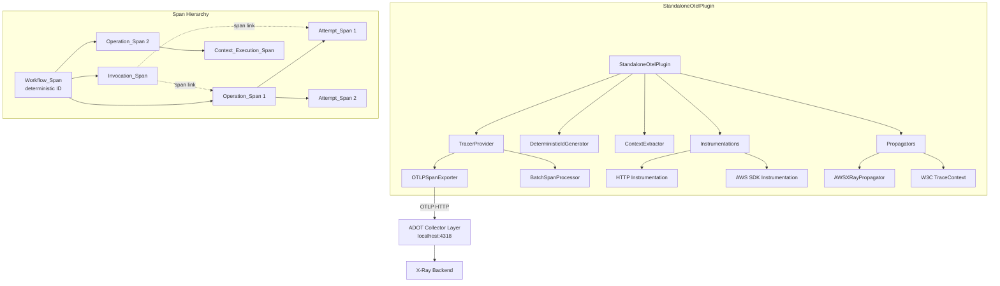

# Design Document: StandaloneOtelPlugin

## Overview

The `StandaloneOtelPlugin` is a self-contained OpenTelemetry instrumentation plugin for the `@aws/durable-execution-sdk-js-otel` package. It implements the `DurableInstrumentationPlugin` interface and provides full distributed tracing without requiring the ADOT Lambda layer's auto-instrumentation. Instead, it only requires a collector-only layer (or equivalent OTLP endpoint) for span transport.

### Key Design Decisions

1. **Composition over inheritance**: `StandaloneOtelPlugin` is a new class rather than a subclass of `OtelPlugin`. The span lifecycle semantics differ significantly (Workflow_Span, deferred export, invocation span as sibling rather than parent), making inheritance brittle.

2. **Workflow_Span as synthetic root**: Unlike `OtelPlugin` which uses the invocation span as the trace root, `StandaloneOtelPlugin` introduces a synthetic Workflow_Span with a deterministic span ID. This span is only exported on terminal invocations (SUCCEEDED/FAILED), providing a clean trace view.

3. **Invocation_Span as correlation, not parent**: The Invocation_Span is a child of the Workflow_Span but is NOT the parent of Operation_Spans. Instead, operations link to the invocation span via span links, keeping the span hierarchy flat and clean.

4. **Deferred operation span export**: Operation spans are only exported when fully completed. Open spans are discarded at invocation end to prevent partial spans from appearing in the trace backend.

5. **Zero-config default**: `new StandaloneOtelPlugin()` with no arguments provides a fully working setup — TracerProvider, OTLP exporter to `localhost:4318`, HTTP + AWS SDK instrumentation, and X-Ray + W3C propagators.

## Architecture



### Comparison with Existing OtelPlugin

| Aspect               | OtelPlugin                     | StandaloneOtelPlugin               |
| -------------------- | ------------------------------ | ---------------------------------- |
| TracerProvider       | Uses global or user-provided   | Creates and manages internally     |
| Trace root           | Invocation span                | Workflow_Span (synthetic)          |
| Operation parent     | Invocation span                | Workflow_Span                      |
| Invocation span role | Parent of operations           | Sibling with span links            |
| Export timing        | All spans exported immediately | Operations deferred until complete |
| HTTP instrumentation | Not registered                 | Registered by default              |
| Propagators          | Relies on ADOT layer           | Self-registers X-Ray + W3C         |
| OTLP export          | Relies on ADOT layer           | Configures OTLPSpanExporter        |
| Lambda attributes    | Not set (ADOT handles)         | Sets faas._, cloud._ attributes    |

## Components and Interfaces

### StandaloneOtelPluginConfig

```typescript
export interface StandaloneOtelPluginConfig {
  /** Custom TracerProvider. If provided, the plugin skips all auto-setup. */
  tracerProvider?: TracerProvider;

  /** Context extractor function. Defaults to xRayContextExtractor. */
  contextExtractor?: ContextExtractor;

  /** Instrumentation scope name. Defaults to "aws-durable-execution-sdk-js". */
  instrumentationName?: string;

  /** Whether to register HTTP instrumentation. Defaults to true. */
  enableHttpInstrumentation?: boolean;

  /** OTLP exporter configuration. */
  exporterConfig?: {
    /** Exporter endpoint. Defaults to env OTEL_EXPORTER_OTLP_ENDPOINT or http://localhost:4318/v1/traces. */
    endpoint?: string;
    /** Custom headers for the exporter. */
    headers?: Record<string, string>;
  };

  /** Custom propagators. When provided, replaces the default [AWSXRay, W3CTraceContext]. */
  propagators?: TextMapPropagator[];
}
```

### StandaloneOtelPlugin Class

```typescript
export class StandaloneOtelPlugin implements DurableInstrumentationPlugin {
  // Shared utilities (reused from existing package)
  private readonly idGenerator: DeterministicIdGenerator;
  private readonly contextExtractor: ContextExtractor;

  // TracerProvider (internally managed or user-provided)
  private readonly tracerProvider: TracerProvider;
  private readonly tracer: Tracer;
  private readonly ownsProvider: boolean; // true if we created the provider

  // Per-invocation state
  private workflowSpan: Span | undefined;
  private invocationSpan: Span | undefined;
  private spanMap: Map<string, Span>;
  private executionArn: string;
  private attemptSpan: Span | undefined;
  private contextExecutionCount: Map<string, number>;

  // Lifecycle hooks (DurableInstrumentationPlugin)
  async onInvocationStart(info: InvocationInfo): Promise<void>;
  wrapInvocation(
    info: InvocationInfo,
    fn: () => Promise<DurableExecutionInvocationOutput>,
  ): Promise<DurableExecutionInvocationOutput>;
  async onInvocationEnd(info: InvocationEndInfo): Promise<void>;
  async onOperationStart(info: OperationInfo): Promise<void>;
  wrapChildContextFn(info: OperationInfo, fn: () => unknown): unknown;
  async onOperationEnd(info: OperationEndInfo): Promise<void>;
  async onOperationAttemptStart(info: AttemptInfo): Promise<void>;
  wrapOperationAttemptFn(info: AttemptInfo, fn: () => unknown): unknown;
  async onOperationAttemptEnd(info: AttemptEndInfo): Promise<void>;
  async onOperationChange(info: OperationChangeInfo): Promise<void>;
  enrichLogContext(): Record<string, string | number | boolean> | undefined;
}
```

### DeterministicIdGenerator Extension

```typescript
// New method added to existing DeterministicIdGenerator
export function deriveWorkflowSpanId(executionArn: string): string;
```

This function hashes the execution ARN with SHA-256 using a distinct salt (to differentiate from `deriveSpanIdFromOperationId`) and returns the first 16 lowercase hex characters. It throws if the ARN is empty.

### Key Behavioral Differences from OtelPlugin

#### onInvocationStart

1. Derive workflow span ID from execution ARN using `deriveWorkflowSpanId`
2. Create Workflow_Span (in-memory, not exported yet) with deterministic ID
3. Create Invocation_Span as child of Workflow_Span with Lambda attributes
4. Set `faas.invocation_id`, `cloud.*` attributes on Invocation_Span

#### onInvocationEnd

1. End Invocation_Span (always exported)
2. If status is SUCCEEDED or FAILED (terminal):
   - Set `durable.execution.status` on Workflow_Span
   - End and export Workflow_Span
   - Discard any open Operation_Spans (don't export them)
3. If status is PENDING or RETRYING (non-terminal):
   - Discard Workflow_Span without exporting
   - Discard open Operation_Spans
4. Flush TracerProvider
5. Clear per-invocation state

#### onOperationStart

- Create Operation_Span as child of **Workflow_Span** (not invocation span)
- For nested operations (has parentId): parent under the parent operation's span
- Add span link to Invocation_Span
- Same deterministic span ID logic as OtelPlugin

#### onOperationEnd

- Same-invocation operations: end and export with span link to Invocation_Span
- Cross-invocation operations: create span with deterministic ID, set start/end times, add link to Invocation_Span, export immediately
- Skip replayed WAIT/INVOKE/CHAINED_INVOKE/CALLBACK (same as OtelPlugin)

#### wrapChildContextFn (CONTEXT operations)

- Create Context_Execution_Span as child of the CONTEXT Operation_Span
- Name: `{operationName} execution {N}` (1-based counter per context)
- Set as active context for the wrapped function
- End span when function completes (record error if thrown)

## Data Models

### Span Attributes

#### Workflow_Span Attributes

| Attribute                  | Type   | Description                          |
| -------------------------- | ------ | ------------------------------------ |
| `durable.execution.arn`    | string | The execution ARN                    |
| `durable.execution.status` | string | "SUCCEEDED" or "FAILED" (set at end) |

#### Invocation_Span Attributes

| Attribute               | Type    | Description                           |
| ----------------------- | ------- | ------------------------------------- |
| `faas.invocation_id`    | string  | Lambda request ID                     |
| `faas.coldstart`        | boolean | True if first invocation in container |
| `cloud.resource_id`     | string  | Invoked function ARN                  |
| `cloud.provider`        | string  | "aws"                                 |
| `cloud.platform`        | string  | "aws_lambda"                          |
| `faas.max_memory`       | number  | Configured memory (MB), if available  |
| `durable.execution.arn` | string  | The execution ARN                     |

#### Operation_Span Attributes (same as OtelPlugin)

| Attribute                   | Type   | Description                  |
| --------------------------- | ------ | ---------------------------- |
| `durable.execution.arn`     | string | The execution ARN            |
| `durable.operation.id`      | string | Operation ID                 |
| `durable.operation.type`    | string | Operation type               |
| `durable.operation.name`    | string | Operation name (optional)    |
| `durable.operation.subtype` | string | Operation subtype (optional) |

#### Attempt_Span Attributes (same as OtelPlugin)

| Attribute                   | Type   | Description                  |
| --------------------------- | ------ | ---------------------------- |
| `durable.execution.arn`     | string | The execution ARN            |
| `durable.operation.id`      | string | Operation ID                 |
| `durable.operation.type`    | string | Operation type               |
| `durable.operation.name`    | string | Operation name (optional)    |
| `durable.operation.subtype` | string | Operation subtype (optional) |
| `durable.operation.attempt` | number | Attempt number (1-based)     |
| `durable.attempt.outcome`   | string | "SUCCEEDED" or "FAILED"      |

#### Context_Execution_Span Attributes

Same as Operation_Span attributes (no new attribute namespaces introduced).

### Internal State Model

```typescript
// Per-invocation state (cleared in onInvocationEnd)
interface PerInvocationState {
  workflowSpan: Span | undefined;
  invocationSpan: Span | undefined;
  spanMap: Map<string, Span>; // operationId -> Span
  executionArn: string;
  attemptSpan: Span | undefined;
  contextExecutionCount: Map<string, number>; // operationId -> execution count
}
```

## Correctness Properties

_A property is a characteristic or behavior that should hold true across all valid executions of a system — essentially, a formal statement about what the system should do. Properties serve as the bridge between human-readable specifications and machine-verifiable correctness guarantees._

### Property 1: deriveWorkflowSpanId produces valid deterministic output

_For any_ non-empty string used as an execution ARN, `deriveWorkflowSpanId` SHALL return a 16-character lowercase hexadecimal string that is not equal to `"0000000000000000"`, and calling it twice with the same input SHALL produce the same output.

**Validates: Requirements 7.1, 7.2**

### Property 2: deriveWorkflowSpanId collision resistance

_For any_ pair of distinct non-empty strings, `deriveWorkflowSpanId` SHALL produce different 16-character hex outputs (with overwhelming probability given SHA-256 distribution).

**Validates: Requirements 7.3**

### Property 3: Workflow span uses deterministic ID from execution ARN

_For any_ valid execution ARN, when `onInvocationStart` is called (whether `isFirstInvocation` is true or false), the Workflow_Span's span ID SHALL equal the value returned by `deriveWorkflowSpanId(executionArn)`.

**Validates: Requirements 1.1, 1.2, 7.4**

### Property 4: Span hierarchy invariant

_For any_ invocation lifecycle (start through end), the Invocation_Span SHALL have its `parentSpanId` set to the Workflow_Span's span ID, Operation_Spans SHALL NOT have the Invocation_Span as their parent, and the Invocation_Span SHALL always appear in exported spans regardless of the terminal status.

**Validates: Requirements 1.5, 2.3, 2.5**

### Property 5: Operation and attempt spans link to invocation span

_For any_ Operation_Span or Attempt_Span exported during an invocation, the span SHALL contain a span link whose span ID matches the Invocation_Span's span ID for that invocation.

**Validates: Requirements 2.4**

### Property 6: Open operation spans discarded at invocation end

_For any_ set of operations started via `onOperationStart` that have not received a corresponding `onOperationEnd` call before `onInvocationEnd`, those Operation_Spans SHALL NOT appear in the exported spans.

**Validates: Requirements 9.4**

### Property 7: Cross-invocation operation span uses deterministic ID

_For any_ non-replay operation where `onOperationEnd` is called without a preceding `onOperationStart` in the same invocation, the StandaloneOtelPlugin SHALL create and export an Operation_Span whose span ID equals `deriveSpanIdFromOperationId(operationId, executionArn)`.

**Validates: Requirements 9.3**

### Property 8: Attempt spans parented under deterministic operation span ID

_For any_ attempt span created by `onOperationAttemptStart`, its `parentSpanId` SHALL equal `deriveSpanIdFromOperationId(operationId, executionArn)` — the deterministic Operation_Span ID — regardless of which invocation the attempt occurs in.

**Validates: Requirements 9.6**

### Property 9: Context_Execution_Span lifecycle

_For any_ CONTEXT type operation, when `wrapChildContextFn` is called, a Context_Execution_Span SHALL be created as a child of the CONTEXT Operation_Span, SHALL be set as the active context during the wrapped function's execution, and SHALL be ended when the function returns. Across multiple invocations of the same context, all Context_Execution_Spans SHALL share the same parent span ID (the deterministic CONTEXT Operation_Span ID).

**Validates: Requirements 10.1, 10.2, 10.3, 10.7**

### Property 10: Error recording on operation and context execution spans

_For any_ span (Operation_Span, Attempt_Span, or Context_Execution_Span) that ends with an associated error, the span SHALL have its status set to ERROR with the error message, and SHALL have an exception event recorded.

**Validates: Requirements 9.8, 10.5**

### Property 11: Span attributes match input data

_For any_ execution ARN and operation info provided to the plugin lifecycle hooks, the exported spans SHALL contain attributes that exactly match the input values: `durable.execution.arn` equals the ARN, `durable.operation.id` equals the operation ID, `durable.operation.type` equals the type, and `faas.invocation_id` equals the request ID.

**Validates: Requirements 1.6, 4.1**

## Error Handling

### Export Failures

The StandaloneOtelPlugin treats span export failures as non-fatal. When the OTLP exporter fails to connect or export (network timeout, connection refused, non-2xx response):

1. The `BatchSpanProcessor` handles retries internally per OTel SDK behavior
2. Failed exports are logged as warnings via the OTel SDK's diagnostic logger
3. The plugin continues processing lifecycle hooks without interruption
4. No exceptions propagate to the durable execution SDK

### Lifecycle Hook Errors

Per the `DurableInstrumentationPlugin` contract, the SDK swallows errors thrown by plugin hooks. The StandaloneOtelPlugin adds defensive error handling within each hook:

- `try/catch` around span creation and manipulation
- Graceful no-op when expected state is missing (e.g., `spanMap` doesn't contain an operation ID)
- `forceFlush` errors are caught and ignored

### Invalid Configuration

- If `OTEL_DURABLE_SAMPLING_RATIO` is set to a non-numeric or out-of-range value, fall back to `AlwaysOnSampler`
- If `OTEL_EXPORTER_OTLP_ENDPOINT` is set but malformed, the exporter may fail to connect — treated as an export failure (non-fatal)

### Empty Execution ARN

`deriveWorkflowSpanId` throws an `Error` if called with an empty string. The plugin should never encounter this in practice (the SDK always provides a non-empty ARN), but it protects against misuse.

## Testing Strategy

### Property-Based Testing

The property tests use `fast-check` (already a devDependency in the otel package) with a minimum of 100 iterations per property. Each test is tagged with its corresponding design property.

**PBT Library**: `fast-check` (v3.23.2, already in devDependencies)

**Configuration**: Minimum 100 iterations per property test.

**Tag format**: `Feature: otel-standalone-mode, Property {number}: {property_text}`

Properties 1–11 are implemented as property-based tests covering:

- `deriveWorkflowSpanId` determinism and validity (Properties 1, 2)
- Workflow span ID correctness (Property 3)
- Span hierarchy structure (Property 4)
- Span link correctness (Property 5)
- Deferred export / discard behavior (Property 6)
- Cross-invocation span creation (Property 7)
- Attempt span parentage (Property 8)
- Context execution span lifecycle (Property 9)
- Error recording (Property 10)
- Attribute correctness (Property 11)

### Unit Tests (Example-Based)

Unit tests cover specific scenarios not suited to PBT:

- Terminal vs non-terminal invocation end behavior (export vs discard Workflow_Span)
- `faas.coldstart` toggling between first and subsequent invocations
- Replay skipping for WAIT/INVOKE/CHAINED_INVOKE/CALLBACK types
- Lambda semantic convention attributes (`cloud.provider`, `cloud.platform`, `faas.max_memory`)
- Custom TracerProvider bypass (no auto-instrumentation)
- `OTEL_DURABLE_SAMPLING_RATIO` sampler configuration
- `OTEL_EXPORTER_OTLP_ENDPOINT` override

### Integration Tests

Integration tests verify end-to-end behavior with real OTel SDK components:

- HTTP instrumentation producing child spans under the correct parent context
- OTLP export to a mock collector endpoint
- Propagator injection of `X-Amzn-Trace-Id` and `traceparent` headers on outgoing requests
- Full lifecycle with `LocalDurableTestRunner` using the StandaloneOtelPlugin

### Test Infrastructure

Tests use the same pattern as existing `plugin.test.ts`:

- `InMemorySpanExporter` + `SimpleSpanProcessor` + `NodeTracerProvider` for span capture
- Helper functions (`makeInvocationInfo`, `makeOperationInfo`, etc.) for constructing test inputs
- `ReadableSpan` inspection for verifying attributes, links, parent relationships
