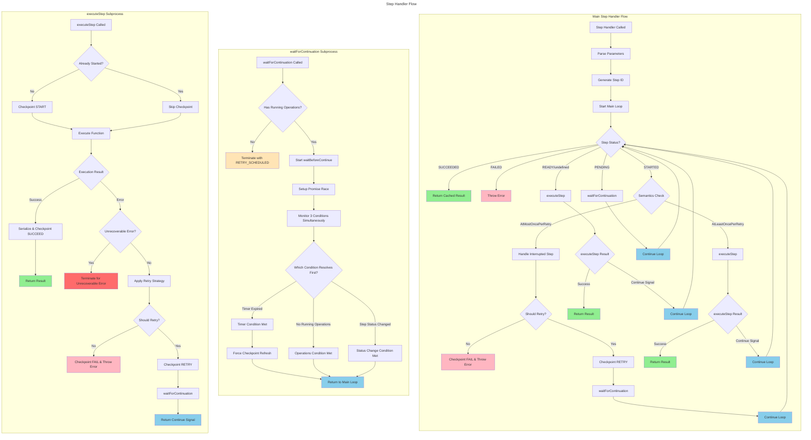

# Step Handler Flowchart

## waitForContinuation Detailed Logic

The expanded waitForContinuation subprocess now shows:

**1. Initial Check**: `Has Running Operations?`
- If no operations → immediate termination
- If operations exist → proceed to sophisticated waiting

**2. Promise Race Setup**: `Setup Promise Race`
- Creates multiple promises to monitor different conditions
- Uses `Promise.race()` to wait for first condition to resolve

**3. Three Monitoring Conditions**:
- **Timer Promise**: Waits for `NextAttemptTimestamp` to expire
- **Operations Promise**: Polls `hasRunningOperations()` every 100ms
- **Status Promise**: Polls step status changes every 100ms

**4. Condition Resolution**:
- **Timer Expired**: Forces checkpoint refresh to get latest data
- **No Running Operations**: Can safely return to main loop
- **Status Changed**: Step was updated externally, re-evaluate immediately
