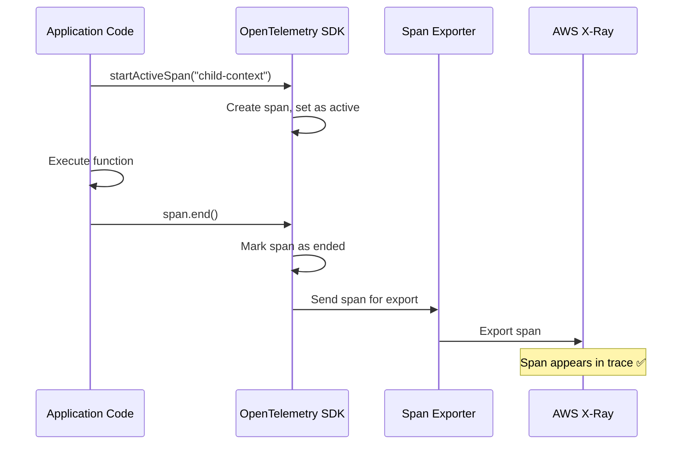
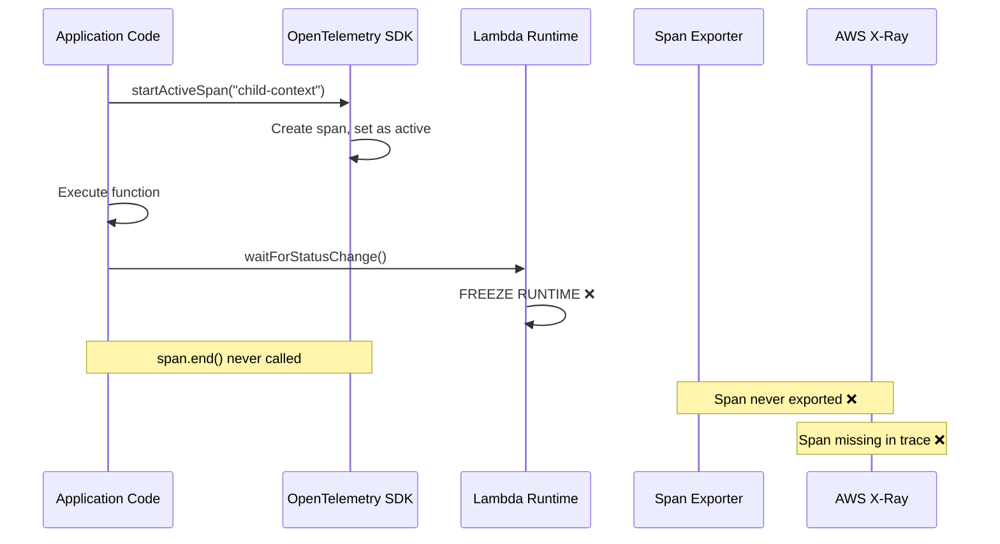
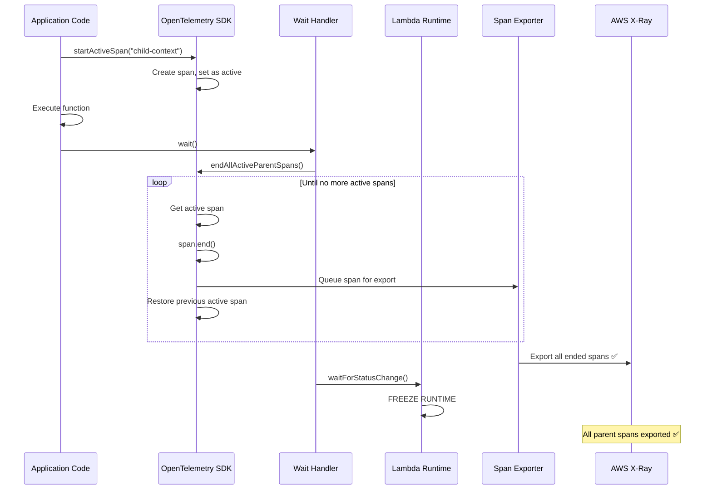
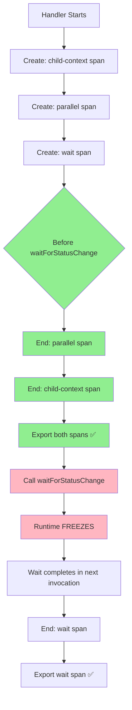
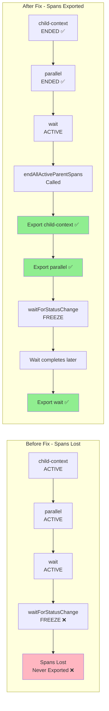
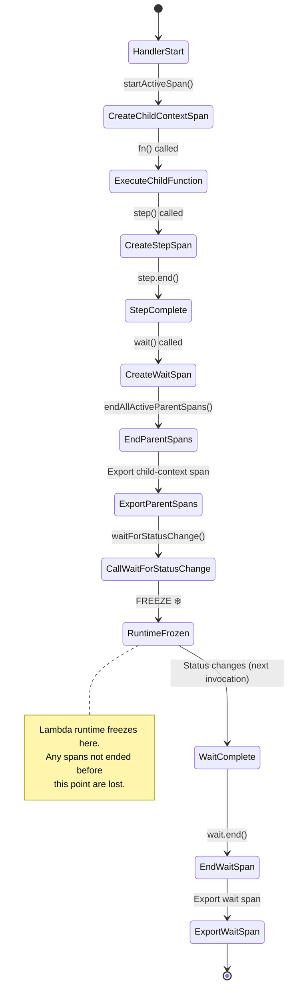
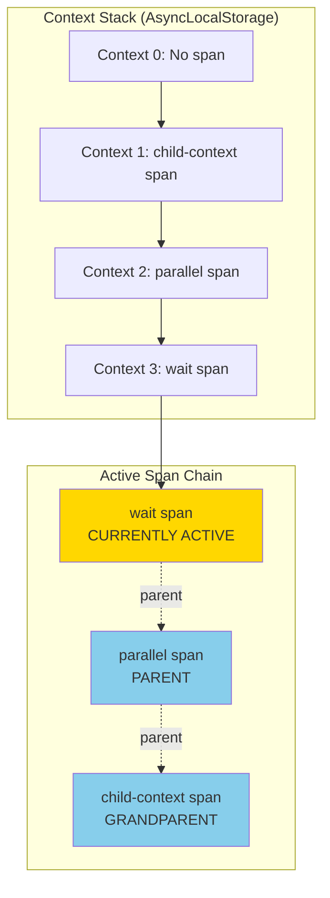
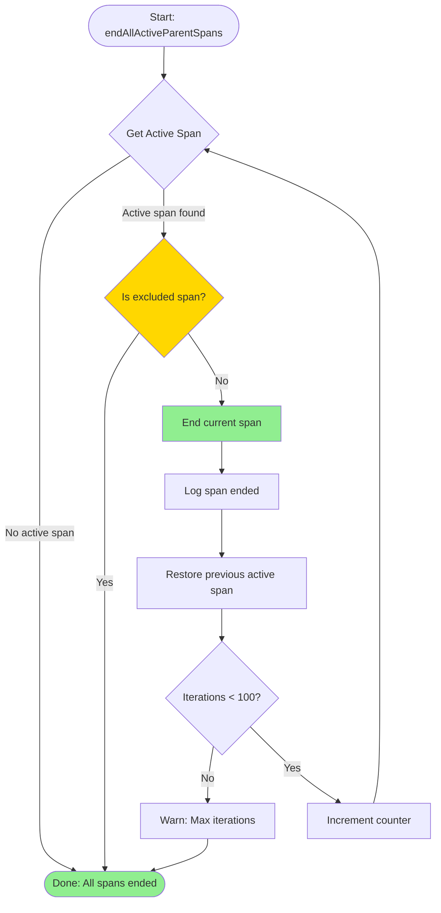

# OpenTelemetry Span Freezing Issue in AWS Durable Functions

## Executive Summary

This document describes a critical issue where OpenTelemetry spans are lost when the AWS Lambda runtime freezes during durable function operations. The issue occurs because spans must be explicitly ended (`span.end()`) before they can be exported, but the Lambda runtime can freeze before `span.end()` is called, causing spans to be lost.

## Table of Contents

1. [Problem Statement](#problem-statement)
2. [How OpenTelemetry Spans Work](#how-opentelemetry-spans-work)
3. [When Lambda Runtime Freezes](#when-lambda-runtime-freezes)
4. [Affected Scenarios](#affected-scenarios)
5. [Root Cause Analysis](#root-cause-analysis)
6. [Solution](#solution)
7. [Implementation Details](#implementation-details)
8. [Visual Diagrams](#visual-diagrams)

---

## Problem Statement

### The Issue

When durable function operations (such as `wait`, `invoke`, or `waitForCondition`) are executed inside nested contexts (e.g., `runInChildContext`), the parent context spans are not exported to X-Ray. This results in "missing spans" in the trace visualization.

### Why It Happens

1. A parent span (e.g., `child-context`) is created and wraps the execution
2. Inside that span, a wait operation is called
3. The wait operation calls `waitForStatusChange()`, which **freezes the Lambda runtime**
4. The parent span's `span.end()` is never called because the function hasn't returned yet
5. When the runtime freezes, any spans that haven't been ended are lost
6. The span never appears in X-Ray because it was never exported

### Example Scenario

```typescript
await ctx.runInChildContext("child-context", async (childCtx) => {
  // Child context span is created here (ACTIVE)

  await childCtx.step("step-1", async () => {
    // Step span is created and completed ✅
  });

  await childCtx.wait({ seconds: 5 }); // ❌ Runtime freezes here!
  // Child context span.end() never gets called
  // Span is lost ❌
});
```

---

## How OpenTelemetry Spans Work

### Span Lifecycle

OpenTelemetry spans follow a strict lifecycle:

1. **Creation**: Span is created with `tracer.startSpan()` or `tracer.startActiveSpan()`
2. **Active**: Span is active and can have attributes/events added
3. **Ending**: Span must be explicitly ended with `span.end()`
4. **Export**: Only ended spans are sent to span processors and exporters
5. **Visualization**: Exported spans appear in tracing backends (X-Ray, etc.)

### Key Constraints

- **`forceFlush()` only exports already-ended spans**: It does NOT close open spans
- **Spans must be explicitly ended**: There is no automatic cleanup
- **Open spans are lost on process exit/freeze**: If a span isn't ended, it's never exported

### Span Context Propagation

OpenTelemetry uses `AsyncLocalStorage` to track the active span context:

```typescript
// When you call startActiveSpan, it:
1. Gets the current active span (parent)
2. Creates a new span with that parent
3. Sets the new span as active in AsyncLocalStorage
4. When span.end() is called, restores the previous active span
```

This means only **one span is active at a time** in the current context, but parent spans are tracked in the context chain.

---

## When Lambda Runtime Freezes

### What is Runtime Freezing?

AWS Lambda can "freeze" the execution environment when:

- The handler function returns
- All promises are resolved
- The event loop is idle
- **Durable operations cause explicit freezes** (checkpointing, waiting)

When frozen, the Lambda runtime:

- Suspends execution
- Preserves memory/state
- Can be "thawed" later to resume execution

### Durable Function Freeze Points

The following operations cause the Lambda runtime to freeze:

#### 1. `waitForStatusChange(stepId)`

**Used in:**

- `wait()` operations
- `invoke()` operations
- `waitForCallback()` operations

**What happens:**

```typescript
await checkpoint.waitForStatusChange(stepId);
// ↑ Runtime FREEZES here
// Execution resumes in a future Lambda invocation when status changes
```

#### 2. `waitForRetryTimer(stepId)`

**Used in:**

- Step retries
- `waitForCondition()` retry delays

**What happens:**

```typescript
await checkpoint.waitForRetryTimer(stepId);
// ↑ Runtime may FREEZE here (depending on timer implementation)
// Execution resumes when retry timer expires
```

#### 3. Checkpoint Operations

**What happens:**

```typescript
await checkpoint.checkpoint(stepId, data);
// Checkpoint is queued, but runtime may freeze if:
// - Response size limit is reached
// - Handler returns before checkpoint completes
```

### Freeze Timing

The runtime freezes **synchronously** when these operations are called:

- The freeze happens **immediately** when `waitForStatusChange()` is called
- Any code after the freeze point doesn't execute until the next invocation
- `finally` blocks may not execute if they come after the freeze point

---

## Affected Scenarios

### Scenario 1: Wait Inside Child Context

**Code:**

```typescript
await ctx.runInChildContext("child-context", async (childCtx) => {
  await childCtx.wait({ seconds: 5 });
});
```

**Problem Flow:**

```
1. Child context span created (ACTIVE)
2. wait() called
3. waitForStatusChange() called → RUNTIME FREEZES
4. Child context span.end() never called (function hasn't returned)
5. Span lost ❌
```

### Scenario 2: Nested Contexts with Wait

**Code:**

```typescript
await ctx.runInChildContext("child-context", async (childCtx) => {
  await childCtx.parallel("parallel", [
    async () => {
      await childCtx.wait({ seconds: 5 }); // Freezes here
    },
  ]);
});
```

**Problem Flow:**

```
1. Child context span created (ACTIVE)
2. Parallel span created (ACTIVE, child of child-context)
3. Wait span created (ACTIVE, child of parallel)
4. waitForStatusChange() called → RUNTIME FREEZES
5. Parallel span.end() never called ❌
6. Child context span.end() never called ❌
7. Both spans lost ❌
```

### Scenario 3: Invoke Inside Child Context

**Code:**

```typescript
await ctx.runInChildContext("child-context", async (childCtx) => {
  await childCtx.invoke("other-function", { input: "data" });
});
```

**Problem Flow:**

```
1. Child context span created (ACTIVE)
2. Invoke span created (ACTIVE, child of child-context)
3. waitForStatusChange() called → RUNTIME FREEZES
4. Child context span.end() never called ❌
5. Span lost ❌
```

### Scenario 4: Wait After Step in Child Context

**Code:**

```typescript
await ctx.runInChildContext("child-context", async (childCtx) => {
  await childCtx.step("step-1", async () => {
    // Step span created and ended ✅
  });

  await childCtx.wait({ seconds: 5 }); // Freezes here
  // Child context span.end() never called ❌
});
```

**Problem Flow:**

```
1. Child context span created (ACTIVE)
2. Step span created and completed ✅
3. wait() called
4. waitForStatusChange() called → RUNTIME FREEZES
5. Child context span.end() never called ❌
6. Span lost ❌
```

---

## Root Cause Analysis

### Why Spans Are Lost

1. **OpenTelemetry requires explicit `span.end()`**: Spans are only exported after they're ended
2. **Runtime freezes before `span.end()`**: When `waitForStatusChange()` is called, execution freezes immediately
3. **Finally blocks don't execute**: If `span.end()` is in a `finally` block after the freeze point, it never runs
4. **No automatic cleanup**: OpenTelemetry doesn't auto-end spans on process exit/freeze

### Why `forceFlush()` Doesn't Help

- `forceFlush()` only exports **already-ended** spans
- It does NOT close open spans
- If a span hasn't been ended, it's not in the export buffer
- Calling `forceFlush()` on open spans has no effect

### Context Propagation Issue

OpenTelemetry uses `AsyncLocalStorage` to track the active span:

- Only **one span is active** at a time in the current context
- When a span is ended, the previous active span is restored
- However, if the runtime freezes, the context restoration never happens
- Parent spans remain "active" in memory but are never exported

---

## Solution

### Approach: Recursive Span Ending Before Freeze

Before any operation that freezes the runtime, we recursively end all active parent spans.

### Implementation

#### 1. Recursive Span Ending Function

```typescript
export function endAllActiveParentSpans(excludeSpanName?: string): string[] {
  const endedSpanIds: string[] = [];
  let iterations = 0;
  const maxIterations = 100;

  while (iterations < maxIterations) {
    const activeSpan = traceApi.getActiveSpan();

    if (!activeSpan) {
      break; // No more active spans
    }

    const spanName = (activeSpan as any).name || "unknown";

    // Exclude the current operation's span (e.g., wait span)
    if (excludeSpanName && spanName.includes(excludeSpanName)) {
      break;
    }

    // End this span (restores previous active span)
    activeSpan.end();
    endedSpanIds.push(activeSpan.spanContext().spanId);
    iterations++;
  }

  return endedSpanIds;
}
```

#### 2. Integration Points

**Wait Handler:**

```typescript
// Before waitForStatusChange() freezes
const endedSpanIds = endAllActiveParentSpans("wait step");
await checkpoint.waitForStatusChange(stepId);
```

**Invoke Handler:**

```typescript
// Before waitForStatusChange() freezes
const endedSpanIds = endAllActiveParentSpans("invoke");
await checkpoint.waitForStatusChange(stepId);
```

### How It Works

1. **Get current active span**: The span that's currently active in the context
2. **End it**: This restores the previous active span (parent)
3. **Repeat**: Continue until no more active spans or we hit the excluded span
4. **Result**: All parent spans are ended and exported before the freeze

### Why This Works

- **OpenTelemetry context restoration**: When a span is ended, the previous active span becomes active again
- **Walking up the chain**: By repeatedly ending the active span, we walk up the entire parent chain
- **Export before freeze**: All spans are ended and queued for export before the runtime freezes
- **Exclusion mechanism**: We exclude the current operation's span (e.g., wait span) so it can represent the full operation duration

---

## Implementation Details

### Modified Files

1. **`otel-instrumentation.ts`**:
   - Added `endAllActiveParentSpans()` function
   - Exported for use in handlers

2. **`wait-handler.ts`**:
   - Calls `endAllActiveParentSpans("wait step")` before `waitForStatusChange()`
   - Logs which spans were ended

3. **`invoke-handler.ts`**:
   - Calls `endAllActiveParentSpans("invoke")` before `waitForStatusChange()`
   - Logs which spans were ended

### Additional Fixes

1. **`withRunInChildContextSpan`**: Moved `span.end()` to execute immediately after function completes, before returning (not in finally block)

2. **`withWaitSpan`**: Added logging to track when wait spans are ended

### Safety Mechanisms

- **Max iterations limit**: Prevents infinite loops (100 iterations max)
- **Exclusion check**: Prevents ending the current operation's span
- **Logging**: Tracks which spans were ended for debugging

---

## Visual Diagrams

### Diagram 1: Normal Span Lifecycle (No Freeze)



### Diagram 2: Problem Scenario - Freeze Before Span End



### Diagram 3: Solution - Recursive Span Ending Before Freeze



### Diagram 4: Nested Context Scenario



### Diagram 5: Span Context Chain Before and After Fix



### Diagram 6: Complete Execution Flow with Freeze Points



### Diagram 7: OpenTelemetry Context Stack



### Diagram 8: Recursive Span Ending Process



---

## Testing and Verification

### How to Verify the Fix

1. **Check CloudWatch Logs**: Look for `[OTel] endAllActiveParentSpans: Ended X parent span(s)` messages
2. **Check X-Ray Traces**: Verify that child context spans appear in the trace
3. **Verify Span Hierarchy**: Ensure parent-child relationships are correct

### Expected Log Output

```
[OTel] endAllActiveParentSpans: Ending active span "child-context" (spanId=abc123)
[OTel] endAllActiveParentSpans: Successfully ended span "child-context" (spanId=abc123)
[OTel] endAllActiveParentSpans: Ended 1 parent span(s) before freeze
```

### Expected X-Ray Trace Structure

```
durable-execution (root)
  └── child-context ✅ (now appears!)
      ├── step-1 ✅
      └── wait step ✅
```

---

## Related Operations

### Operations That Freeze Runtime

| Operation            | Handler                         | Freeze Method           | Fixed?          |
| -------------------- | ------------------------------- | ----------------------- | --------------- |
| `wait()`             | `wait-handler.ts`               | `waitForStatusChange()` | ✅ Yes          |
| `invoke()`           | `invoke-handler.ts`             | `waitForStatusChange()` | ✅ Yes          |
| `waitForCallback()`  | `wait-for-callback-handler.ts`  | `waitForStatusChange()` | ⚠️ May need fix |
| `waitForCondition()` | `wait-for-condition-handler.ts` | `waitForRetryTimer()`   | ⚠️ May need fix |
| Step retries         | `step-handler.ts`               | `waitForRetryTimer()`   | ⚠️ May need fix |

### Operations That Don't Freeze

- `step()` - Completes synchronously
- `parallel()` - Completes when all branches done
- `map()` - Completes when all iterations done
- `runInChildContext()` - Completes when function returns (unless it contains freeze operations)

---

## Best Practices

### For Developers Using This SDK

1. **Be aware of freeze points**: Any operation that waits (wait, invoke, etc.) can freeze the runtime
2. **Nested contexts**: If you nest contexts and use wait operations, parent spans will be automatically ended before the freeze
3. **Span visibility**: All spans should now appear in X-Ray, even with nested contexts

### For SDK Maintainers

1. **Add freeze protection**: When adding new operations that freeze, ensure `endAllActiveParentSpans()` is called
2. **Test nested scenarios**: Always test with deeply nested contexts
3. **Monitor span exports**: Check logs to ensure spans are being ended before freezes

---

## Future Considerations

### Potential Improvements

1. **Automatic freeze detection**: Could we detect when a freeze is about to happen and automatically end spans?
2. **Span lifecycle hooks**: Could we add hooks that are called before freezes?
3. **Better error handling**: What happens if `endAllActiveParentSpans()` fails?

### Open Questions

1. **`waitForRetryTimer()`**: Does this also freeze the runtime? Should we add protection here too?
2. **Checkpoint operations**: Do checkpoints cause freezes, or just queue operations?
3. **Other wait operations**: Are there other operations that freeze that we haven't covered?

---

## Conclusion

The issue of missing spans in nested contexts with wait operations has been resolved by implementing recursive span ending before runtime freezes. This ensures all parent spans are ended and exported before the Lambda runtime freezes, preventing span loss.

The solution is robust and handles deeply nested scenarios, ensuring complete trace visibility in X-Ray even when operations span multiple Lambda invocations.

---

## References

- [OpenTelemetry Span Specification](https://opentelemetry.io/docs/specs/otel/trace/api/)
- [OpenTelemetry SDK Specification](https://opentelemetry.io/docs/specs/otel/trace/sdk/)
- [AWS Lambda Durable Functions Documentation](https://docs.aws.amazon.com/lambda/latest/dg/durable-execution-sdk.html)
- [AWS X-Ray Tracing](https://docs.aws.amazon.com/xray/latest/devguide/aws-xray.html)
